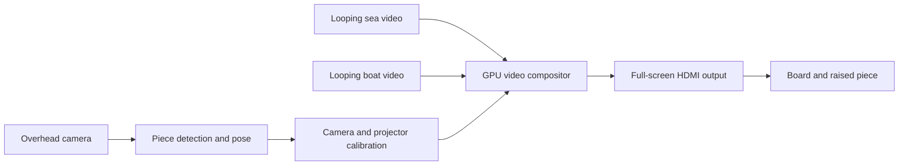

# ProjectTabletop

**Current scope, October 6, 2026:** The launcher has seven boards: Dragon Slots, Photo Copy, Blackjack, Paint, Crown & Deed, Globe and Roulette. Six cards fill the first page; a fresh sideways-index or pinch selection on the down arrow reveals Roulette on the second page. Settings contains the Hand-Tracking test. Crown & Deed is the project's property-trading board for human and AI players, with resumable local games. Photo Copy captures an object or the other hand on a grey surface; its bottom controls use caption holds for Swirl, Copy, Clear, Save and Exit. Other controls use their board's gesture or hold policy. The local hand models and board calibration do not establish physical touch. The card-focused design below is retained as a later phase; [README.md](README.md) describes current behavior and verification limits.

**Historical implementation note, September 26, 2026:** The initial card prototype targeted **multiple simultaneously tracked white cards** with distinct camera-visible bright patterns. It captured full webcam snapshots for labeling or offline review, trained a local multiclass shape/pattern model, and supported a separate media assignment for each card. Synthetic two-card recognition and calibration math checks passed. On that setup, the phone appeared as **Android Webcam** at 1920 × 1080, 30 fps; the app captured the projected grid and the projector showed looping local video with black margins. A ten-minute 1080p/30 test clip completed, without measuring displayed/dropped frames or 4K/60 decoding. These are historical observations, not current card-tracking acceptance. No real card was labeled or tracked in that trial; optical alignment and multi-card tracking still need physical testing.

**Status:** Interactive board apps are implemented; broader physical acceptance remains pending. The remainder of this document retains the original card-tracking concept and acceptance criteria, not the current product specification or a release checklist.

**Date:** September 24, 2026.

**Repository name:** ProjectTabletop.

## The idea

Turn a plain white tabletop into an animated game world. An overhead projector shows a moving sea on a **21 × 21 inch** white play area. A player moves a small white piece on that surface. An overhead camera finds the piece, and the projector draws a separate animated boat video precisely on its top. The boat image follows the physical piece when it moves or turns.

The physical piece remains something the player can pick up and move. The projected image supplies its appearance and animation. This first demo is meant to prove that those two things can stay visually aligned during real play.

## Short-term demo

1. Run a local Windows C# application on the laptop.
2. Connect the existing **JMGO N1S Pro 4K** projector to the laptop by HDMI and use it as a second Windows display. Keep a control window on the laptop and a borderless projection window on the projector.
3. Project a high-quality, looping, overhead sea video into the 21-inch square. Keep the rest of the projector's wide image black.
4. Use an overhead camera to locate one movable, slightly raised white piece and determine its position and orientation. Test a small retroreflective bead pattern as a camera-readable code.
5. Render a separate looping boat video onto the visible top of that piece. Mask the boat image to the piece's outline so it does not spill onto the sea.
6. Move and rotate the piece by hand. Its projected boat appearance follows it and recovers after a brief loss of view.

The first optical validation needs **one piece**, followed by a finished app that can recognize and project onto **multiple distinct pieces at once**. Game rules and interactions can be considered after the visual effect works reliably.

## Physical setup and assumptions

| Part | Initial plan |
|---|---|
| Play area | Smooth, matte white 21 × 21 inch board or paper, flat and fixed in place. |
| Piece | One asymmetric white cutout with a mostly matte top. Bond white paper to rigid card or foam board so it stays flat. Its small, measured lift above the board makes it easy to move and gives the top a consistent projection plane. Test sparse bead patches near the edge while preserving a clear central area for the boat image. |
| Projector | Existing JMGO N1S Pro, connected by HDMI. On September 26, its lens was positioned pointing straight down, **49 inches from the board/floor**. The projected image measured about **40 × 23 inches** on the floor, close to the roughly 41 × 23 inches predicted by its 1.2:1 throw ratio. A centered 21-inch square leaves about 1 inch of margin above and below. |
| Camera | The intended camera is the phone on a boom across the board from the projector, mounted lower and angled down. Its previous 33-inch height is a reference, not a required height for this smaller stage. Keep the entire play area in view and provide its live feed to Windows as a camera source. |
| Laptop | Windows 11 laptop running the C# application locally. No cloud service is needed to play the demo videos or track the piece. |

The projector and camera cannot occupy the same vertical line at different heights: the lower device would block the upper one's view or light. In the photographed setup, the projector is higher and to one side, while the phone camera looks down from the opposite side. Separate board and raised-top calibrations map this geometry, but card recognition across the oblique camera view still needs testing. The mount must hold the projector steady, keep its vents clear and aim the lens perpendicular to the board. The straight-down position is now achievable; the next physical check is to project a measured 21-inch square and inspect focus, image size and stability at the center and corners. JMGO documents ceiling mounting with a dedicated bracket, but its published material does not explicitly confirm continuous straight-down operation; verify that orientation before relying on it.

JMGO's Smart Eye Protection can turn off the image when someone enters the projection area. Check its behavior while a player reaches in to move the piece, and keep the physical setup safe for people at the table.

### Surface and reflectivity test

A piece that reflects more light than the board may be easier for the camera to find, but the type of reflection matters. A bright **matte** white top can remain readable from several player positions. A glossy or mirror-like top can create a hotspot or wash out the boat video. Retroreflective film sends much of the projector's light back toward the projector, so the separate camera may not receive the expected bright return. These are material choices to test, not assumed solutions.

Make a few pieces with the same shape and height: bright matte white, satin or glossy white, and matte white with a narrow white retroreflective perimeter. At the actual camera and projector positions, lock the camera exposure and record each piece under a white test image, dark and bright sea frames, and moving sea video. Compare edge visibility in the camera, saturation or glare, and how the boat image looks from seats around the table. Select a finish that supports both tracking and projection.

### Bead-coded piece trial

The proposed [loose glass beads](https://www.amazon.com/dp/B08466BZY4) come in three size ranges, approximately 0.09–0.15 mm, 0.30–0.59 mm and 0.84–1.68 mm. Individual beads may be too small to read reliably at the full-board camera scale. Make several distinct, asymmetric **patches** of beads near the piece's rim and leave its center matte for the projected boat. Start with patches about 5–8 mm across, then size them from actual camera frames. A pattern should identify the card and establish its orientation; first validate one card optically, then several together.

For the first sample, place beads into small wet patches of opaque white paint or another white binder so they are partly embedded and their upper surfaces remain exposed. Do not coat the whole bead with clear glue. Traffic-marking glass beads depend on the backing and embedment depth for retroreflection, so a bead merely glued on white paper may be weaker than expected. Mount the paper on rigid white card to keep the pattern's shape and piece height fixed. Compare it with a plain matte piece and a small piece of commercial retroreflective tape.

Test each sample with the projector alone, then with a small light close to the camera lens. Retroreflectors return light mainly toward its source, so the offset projector may illuminate the camera poorly. Record whether each pattern is read correctly while the sea and boat videos run, with the piece at several board positions and orientations. Check that any bright patches do not spoil the projected boat for players. This is a promising identity method, not yet a verified tracking result.

## Application design

### Video and display

- Output at the projector's actual negotiated HDMI resolution, aiming for **3840 × 2160 at 60 Hz**. Verify this on the laptop and projector rather than assuming it from the product label.
- Decode local video with a Windows media path that can use the GPU, then composite the sea and masked boat into one projector frame. The app must not move full 4K frames through C# pixel arrays on every refresh.
- Begin with known local video files and a seamless sea loop. The sea is the full-stage background; the boat is an independently positioned and rotated video layer.
- Use a render path that can clip the boat layer to the detected physical outline. Test the clip's edge quality on the real piece. A rectangular boat video without a mask would illuminate the board around it.
- Keep automatic projector image repositioning, screen fitting and keystone changes from altering calibration during a session. Align the projector physically first, then calibrate the remaining mapping.

**Current implementation path:** The .NET 10 C# app uses WinUI 3 for the laptop controls and projector window, `MediaFrameReader` for camera capture, `MediaPlayer` frame-server decoding, and Win2D for GPU surface composition and masking. A 1080p/30 local clip looped for over ten minutes on the projector with the webcam active. Actual displayed/dropped frames, 4K/60 decoding, hardware-decoder use, and moving-card masking have not yet passed physical tests. If testing finds a renderer limit, evaluate a lower-level Direct3D/Media Foundation path.

### Piece detection and projection mapping

- Calibrate the camera view to the four corners of the fixed play area. Calibrate projector pixels against known points on the board. Store both mappings for the session and recalibrate when either device moves.
- Track the piece's center, orientation and top outline, not only its approximate bounding box. Use an asymmetric piece so orientation is observable.
- Treat the **board surface** and the **raised piece top** as different planes. A mapping measured only on the board can place the boat video beside the raised piece because the camera and projector view it from different positions. Measure the piece height and calibrate its top plane separately.
- Mask the boat video slightly inside the piece's detected edge. Smooth small detection jitter without making the image visibly lag behind a moved piece.
- The intended result is a **mostly white piece with a clean area for the boat video**. Test whether sparse retroreflective bead patches can provide position, orientation and an identity code for later pieces. A temporary printed marker may be used during development to prove capture, pose and rendering independently; it is not the intended finished method. A recognition model trained for different physical objects should not be assumed to recognize this piece.
- With projected imagery running, reliable detection is the main technical risk. Compare the plain piece's outline and motion with the bead-coded sample under actual lighting. If the beads do not work, evaluate a different camera/lighting method or a trained detector. Do not claim this problem solved until the moving projected piece is demonstrated.
- The current classifier compares outlines and bright patterns in raw camera pixels. Capture labeled examples near the center and edges of the stage, at several orientations, because the angled phone view may change their apparent shape. If that variation causes errors, rectify candidates to the calibrated card-top plane before classification.

## Build sequence

| Step | Deliverable | Check |
|---|---|---|
| 1. Optics | With the projector lens 49 inches above the board, project a 21-inch square calibration grid. The full image has already measured about 40 × 23 inches. | The square fits in the full image; focus is acceptable at center and corners; the mount and orientation remain suitable during a test run. |
| 2. Video output | Windows app sends a looping sea scene to the HDMI display. | Correct display selected; square centered; smooth, sharp playback on the actual projector. |
| 3. Registration | Camera sees the stage; a projected grid is mapped to physical points. | Grid corners and center land where expected after calibration. |
| 4. Tracked video | A temporarily marked test piece drives a masked boat clip. | Moving and turning the piece moves and turns the projected boat without obvious spill. |
| 5. White piece | Compare plain and bead-coded finishes, remove the temporary printed marker and track the intended white piece while the sea and boat videos run. | The chosen finish and lighting provide reliable tracking, correct code reading if beads are used, and a clean projected boat image; alignment meets the demo checks below. |
| 6. Complete demo | Package a repeatable setup and record a short demonstration. | A fresh app launch and calibration reproduce the effect without code changes. |

## Definition of a successful tech demo

- The 21-inch play area shows a clear animated sea with a smooth loop. The laptop can still show controls while the projector shows only the demo output.
- HDMI output is confirmed at the chosen resolution and refresh rate. A ten-minute run shows no sustained stutter, visible tearing or growing playback delay. Record the actual output and dropped-frame measurements; **4K/60 Hz is a target**, not a claim that the current hardware has passed this test.
- With the sea running, the camera finds the intended white piece at the center and at four other locations across the play area, including at two orientations. If a bead code is selected, it reads the same identity at every test location.
- For the expanded multi-card build, show at least two differently patterned white cards at once, each retaining its own identity and assigned image or video while the cards move and cross paths. Record identity swaps, missed detections, and false overlays during this run.
- Once a moved piece settles, the boat video is visibly centered and oriented on its top within **200 ms**, with its rendered edge within **5 mm** of the piece edge at those test locations. These are initial engineering targets to measure and revise after the first physical trial.
- Moving a hand across the camera view or briefly lifting the piece does not leave a permanent boat image behind. When the piece is visible again, the video returns to it without restarting the application.
- The finished demo works locally with the HDMI projector, webcam and supplied media files. It does not depend on an internet connection.

## Outside the first demo

This first build does not need board-game rules, AI opponents, multiplayer networking, sound, a game editor or a library of projected worlds. The sea and boat are the initial test scene; users can choose other local media for the background and each recognized piece. A full game can follow once the core visual registration has been demonstrated.

## Reference material

- [JMGO N1S Pro specifications and mounting FAQ](https://global.jmgo.com/pages/support-center-n1s-pro): 4K output, 1.2:1 throw ratio, 40-inch minimum rated image size and dedicated suspension bracket guidance.
- [JMGO N1S system manual](https://global.jmgo.com/cdn/shop/files/N1S_Series_GTV_System_Manual.pdf?v=9249783432248036449): focus, keystone, image fitting and projection settings.
- [Edmund Optics: illumination and surface reflections](https://www.edmundoptics.com/knowledge-center/video/eo-imaging-lab/eo-imaging-lab-introduction-to-illumination-concepts/) and [3M: how retroreflection works](https://www.3m.com/3M/en_US/scotchlite-reflective-material-us/industries-active-lifestyle/active-lifestyle/how-retroreflection-works/): why bright, glossy and retroreflective finishes behave differently for an offset camera.
- [FHWA: glass beads in reflective markings](https://www.fhwa.dot.gov/publications/research/infrastructure/pavements/12048/005.cfm): the effect of binder, bead embedment and light-source geometry.
- [Microsoft: process camera frames with MediaFrameReader](https://learn.microsoft.com/en-us/windows/apps/develop/camera/process-media-frames-with-mediaframereader).
- [Microsoft: MediaPlayer frame-server mode](https://learn.microsoft.com/en-us/windows/apps/develop/media-playback/play-audio-and-video-with-mediaplayer#use-mediaplayer-in-frame-server-mode).
- [OpenCV: camera calibration](https://docs.opencv.org/4.x/dc/dbb/tutorial_py_calibration.html) and [homography](https://docs.opencv.org/4.x/d1/de0/tutorial_py_feature_homography.html).
