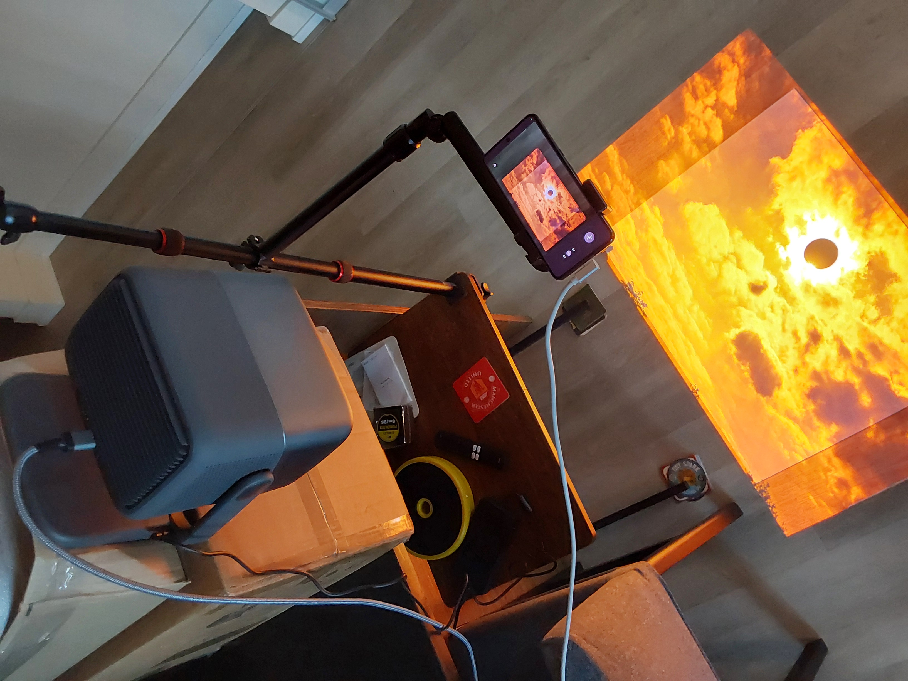

# ProjectTabletop

ProjectTabletop is a local Windows C# app for an interactive projected tabletop. A laptop window handles camera selection, board setup, fingertip tracking, media, and calibration. A separate window sends the scene to the projector. After board setup, a menu of seven boards appears on the board, with a **Settings** cog in its upper-right corner. Bring four extended fingers together, aim with the middle fingertip, then move your index finger sideways to select, or point and pinch; a white spotlight follows each detected hand on boards other than Paint. **Dragon Slots** is a five-reel, 40-line dragon slot machine played with virtual credits and long-press controls. **Settings** holds the built-in **Hand-Tracking** gesture test. **Photo Copy** locks a light onto an object on its grey surface. **Swirl** repeats its photograph inward across the board; **Copy** immediately saves a transparent PNG with a photocopier sound. It can also copy the other hand. **Blackjack** opens a playable casino table against the computer dealer, with virtual credits and projected cards. **Paint** turns physical disturbances into slowly settling layers of paint and metallic particles, with canvas hand spotlights disabled and text-triggered button lighting. **Crown & Deed** offers an oval property-trading board for human and AI players, with resumable local games. **Globe** presents a detailed, slowly rotating Earth with zoom controls in a drawer rising from the bottom. **Roulette** opens Vice Royale, a European single-zero table with virtual credits. Each board has a menu-return control. External game launching is not implemented. Patterned-card recognition and per-card overlays remain available for later work; real-card recognition and alignment still need testing.

## Quick start



1. **Position the projector.** Aim it down at the board on the floor.
2. **Position the webcam.** Aim it at the same location. The webcam preview should show the entire board, with a small margin around all its edges.
3. **Adjust the picture.** Set the projector's brightness to its minimum setting, then increase saturation to taste.

## Install on Windows

Download **ProjectTabletop-1.0.0-win-x64-setup.exe** from [GitHub Releases](https://github.com/abiemann/ProjectTabletop/releases/latest). Downloads from a private repository require an account with repository access. The setup targets Windows 11 on an x64 PC and includes .NET, the Windows App SDK, native camera-analysis dependencies, artwork and hand models. Visual Studio and a separate .NET installation are not required.

Setup installs for the current user without administrator rights and adds a Start menu shortcut. Saved settings and games and exported pictures survive uninstall. The installer is unsigned, so Windows may display an unknown-publisher warning. See [installation and first-run instructions](docs/INSTALL.md), [1.0 release notes](docs/releases/1.0.0.md), and [the release process](docs/RELEASING.md).

The [Windows workflow](.github/workflows/windows.yml) builds and tests on pushes and pull requests, creates a setup, and checks installation, startup, board navigation, a GPU preview, shutdown and uninstall on a hosted Windows runner. A matching version tag publishes the verified setup, SHA-256 checksums and a payload manifest to GitHub Releases.

## License

ProjectTabletop's original code, documentation and artwork are available under
the custom [ProjectTabletop Noncommercial License 1.0](LICENSE). Noncommercial
use, modification and redistribution are permitted subject to its terms.
**Commercial use requires a separate written license from Alexander Biemann
before use begins**, including business operations, paid venues and commercial
products or services. To request a commercial license, contact the
[repository owner](https://github.com/abiemann). This is a source-available
project with a commercial-use restriction.

Third-party components and imagery retain their own licenses; see
[THIRD_PARTY_NOTICES.md](THIRD_PARTY_NOTICES.md) and the accompanying model and
package notices. The project license does not claim rights in users' imported
media, captured photos or other created content. The license ships with both
the app and the standalone local-control executable.

Open **Settings**, then select **Licenses and notices** in its laptop panel or
**Licenses** on the projected Settings board to read the
project license, third-party credits, hand-model licenses and the installer's
collected dependency texts. The document selector includes each packaged notice;
the viewer opens on the laptop, where you can select and copy its text, open the original file, or open the notices
folder. Source builds also show the project and model documents when the
installer's collected dependency folder is absent.

## Build and run

Use Windows 11 x64 with the .NET 10 SDK and Visual Studio 2026's **WinUI application development** workload, including the Windows SDK for target `10.0.26100.0`. The current development setup uses .NET SDK 10.0.401. The first build restores public NuGet dependencies and needs access to NuGet.org unless those packages are already cached. Open `ProjectTabletop.sln`, select **x64**, and start `ProjectTabletop.App`, or use a terminal:

```powershell
dotnet build ProjectTabletop.sln -c Debug -p:Platform=x64
dotnet run --project src/ProjectTabletop.App/ProjectTabletop.App.csproj -c Debug -p:Platform=x64
```

The app and local-control executable include the .NET and Windows App SDK runtimes. The installer pipeline additionally bundles the app-local Visual C++ runtime needed by OpenCV and collects dependency notices; distribute its output instead of copying an arbitrary build folder. Hand models and their licenses are tracked in the repository and need no runtime download. [global.json](global.json) pins .NET SDK 10.0.401, and committed NuGet lock files record the solution's dependency graph; CI restores in locked mode. Windows CI uses the explicit Visual Studio 2026 runner and verifies its package on that hosted image. See Microsoft's [WinUI setup guide](https://learn.microsoft.com/en-us/windows/apps/get-started/start-here) and [self-contained deployment notes](https://learn.microsoft.com/en-us/windows/apps/package-and-deploy/self-contained-deploy/deploy-self-contained-apps).

Run the offline checks with xUnit, from the repository root or Visual Studio's Test Explorer:

```powershell
dotnet test tests/ProjectTabletop.Tests/ProjectTabletop.Tests.csproj
```

`tests/ProjectTabletop.Tests` reports each Interaction, Calibration and Vision check group as its own test, including the Vision board cross-check, Photo Copy camera-image and hand-tracking diagnostics groups that the console run reaches only through flags. `dotnet test ProjectTabletop.sln` also works, but builds the app first. The same groups remain available as console entrypoints; each stops at its first failed check with a non-zero exit code:

```powershell
dotnet run --project src/ProjectTabletop.Interaction/Verification/ProjectTabletop.Interaction.Verification.csproj
dotnet run --project src/ProjectTabletop.Calibration/Verification/ProjectTabletop.Calibration.Verification.csproj
dotnet run --project src/ProjectTabletop.Vision/Regression/ProjectTabletop.Vision.Regression.csproj
```

Vision verification uses the bundled Windows native OpenCV dependency. The xUnit suite also links the production diagnostic recorder and its encoder verification, checking built-in MJPEG recording and decoding without the optional FFmpeg plugin. These checks do not replace physical camera/projector acceptance.

The app uses WinUI 3, Win2D, ComputeSharp Direct2D pixel shaders, Windows MediaPlayer frame-server video, MediaFrameReader, and OpenCvSharp. Video frames are copied to reusable Direct3D surfaces for composition; camera frames are copied to CPU memory for recognition. Choose local Windows-decodable video or PNG/JPEG image files. H.264 MP4 is the recommended first video format. No media files or trained card images are bundled. Paint adapts David Li's MIT-licensed Fluid Paint; the source attribution and license texts are in [THIRD_PARTY_NOTICES.md](THIRD_PARTY_NOTICES.md).

After a successful cardboard scan, the app uses the detected projector-space corners as a GPU clip for the background, test grid, calibration marks, and piece overlays. The media fills the board's bounding rectangle, then the four-corner mask makes every pixel outside the safe inset black. Wide background media is center-cropped to that rectangle to avoid stretching. Piece media is center-cropped to its fitted outline before clipping; some source edges may be omitted. Playback stays black until a successful scan. Starting a new scan, restarting or losing the camera, changing the camera or projector, changing output mode, closing output, or requesting black output invalidates the mask. Rescan after moving the cardboard or any of that hardware. The full-field white illumination used *during* board detection is a temporary setup step.

Pending calibration reads are discarded after camera/board/output resets, a newer calibration request or shutdown; hardware is checked again when a read completes. Piece recognition serializes result publication with reset, so an older worker cannot restore cleared overlays or overwrite current error status. Replacing a vision profile also rejects results from the previous engine. Manual profile loads use the newest request and dispose obsolete loaded engines.

## Rendering resolution

Board interfaces render at the physical pixel density of their calibrated projector footprint, including rotation and perspective. The 1000 × 1000 coordinate system is only a logical layout for drawing and gesture hit testing; it is no longer a fixed bitmap resolution. Menus, buttons, text, static cards, animated cards, and Photo Copy staging use appropriately sized GPU textures. The app declares per-monitor DPI awareness so Windows does not enlarge a low-resolution window on high-DPI projectors. Photo Copy retains native camera pixels and uniformly scaled photographs; increased rendering density cannot invent detail absent from a photograph or video.

Textures stay at the highest required density until alignment/output resets, so smaller laptop previews cannot reduce projector detail or repeatedly reallocate textures. Each texture is bounded by the GPU dimension limit and a 64 Mi-pixel allocation budget. Shared button acquisition receives a separate 1000 × 1000 analysis reference to keep readback and inference costs bounded. `get_status.boardResolution` reports board/card texture dimensions, while `outputRendering` reports the actual fullscreen drawing surface's DIPs, DPI, and physical pixels. Projection snapshots use the selected display's physical resolution. Debug `verify_board_resolution` compares genuine 4K vector detail with an enlarged 1000-pixel baseline and checks DPI, perspective, rotation, hit geometry, and card layers.

Paint's fluid transport uses a separate 32-bit floating-point grid with a maximum 1024-pixel long edge and the board's physical aspect ratio, keeping the repeated GPU solver passes bounded. Wet-surface shading, floating controls, projection and saved images use the native calibrated board raster.

## Local control without a screen overlay

The optional `ProjectTabletop.ControlMcp` console exposes local MCP tools over standard input/output: `get_status`, `start_board_scan`, `rescan_board`, `black_output`, `capture_raw_frame`, `capture_projection_preview`, `stop_scan`, `start_camera`, `stop_camera`, `open_output`, `set_background_media` (absolute local image/video path), `set_hand_tracking` (boolean `enabled`), `show_test_grid`, `show_board_menu`, `show_settings`, `show_hand_tracking_test`, `show_slots`, `slots_action` (string `id`: `slot-spin`, `slot-bet-up`, `slot-bet-down`, `slot-buy`, `slot-refill` or `slot-exit`), `slots_demo` (string `feature`: `Respins`, `FreeSpins` or `Vault` makes the next spin land that feature), `capture_slots_preview`, `show_photo_copy`, `show_blackjack`, `blackjack_action` (string `id`, such as `bj-deal`), `capture_blackjack_preview`, `show_crown_deed`, `crown_deed_action` (string `id`), `capture_crown_deed_preview` (with the legacy `monopoly` names retained as aliases), `show_paint`, and `shutdown`. Build the solution, start `ProjectTabletop.App` in an interactive Windows session that can access the webcam, then configure an MCP client to launch `src\ProjectTabletop.ControlMcp\bin\Debug\net10.0\win-x64\ProjectTabletop.ControlMcp.exe` with no arguments. The app and tool process must run as the same Windows user. This uses a current-user-only named pipe between processes; it needs no network service or credentials. Controlling the app this way avoids the blue Computer Use overlay in camera captures. Status includes `boardApp`, `boardAppTitle`, and the current `blackjack` snapshot, which conceals the dealer's hidden card. Projection snapshots save the compositor scene under the app data directory's `ProjectionSnapshots` folder; `capture_blackjack_preview` saves the full casino table without requiring board alignment or opening output.

For direct diagnostics without an MCP client, run `dotnet run --no-build --project src/ProjectTabletop.ControlMcp/ProjectTabletop.ControlMcp.csproj -- --once get_status` (or replace `get_status` with another tool name). It prints a single JSON response; `capture_raw_frame` returns the absolute PNG path. For media, pass a JSON object such as `--once set_background_media '{"path":"D:\\Media\\sea.mp4"}'`, then use `--once show_test_grid` to return to the grid. `black_output` keeps the webcam running while making the projector window black; use `start_board_scan` or `rescan_board` to restore the white scan. Launch the app and the diagnostic command in a context with the same Windows access rights; sandboxed commands may be denied camera or pipe access.

For card animation diagnostics, `get_status` includes `blackjackAnimation`: HIT flights plus the DEAL clearing/dealing phase, landed-card count and moving cards. It includes the animation durations, progress, positions, rotations and landing rectangles.

After the final center alignment spot passes validation, its black circle expands across the projector field while the selected board grows outward from the same center over 1.3 seconds. The menu appears on the first scan; rescans restore the board already selected. The content grows uniformly without changing its proportions and stays inside the detected board boundary. Hand selection, spotlights, and Photo Copy acquisition wait until the reveal finishes. A new scan, black output, loss of alignment, or a board switch cancels the animation. Local-control status exposes its progress through `boardReveal`.

The ambient scan requires visible edge support along each of the four proposed sides. This rejects floor seams that extend one contour corner beyond the board even when the other three sides look correct. The separate white-light scan and black/white corner-agreement check remain unchanged.

## First setup

Board setup remembers which way the interface faces in projector coordinates, separately from the webcam's rotation. The five ordered spots establish the camera mapping; rescans keep the saved facing direction even if the camera is turned sideways or upside down. This applies to every board, media, and their shared hand hit testing. A new output initially uses the projector's upright direction, regardless of the first scan's camera rotation. **Rotate board 90°** under **Projection output** changes it and saves it per output/mode. Press twice to face the opposite side. A plain board and calibration spots cannot identify where the viewer is standing. Moving or rotating the camera still requires a new scan. Changing the facing clears in-progress Paint artwork and Photo Copy capture state. Local control exposes `projectionSetup.boardFacingDegrees` and accepts `set_board_facing` with a finite `degrees` value.

A facing change reports **saved** only after its settings file is successfully replaced. If saving fails, the new direction applies to the current session and the app displays the actual error. Local control returns `saved` and `settingsError` for `set_board_facing`; `projectionSetup` exposes the settings path, active profile key, initialization state and error for diagnosing relaunch differences. The existing `profileSavedPerOutput` field identifies availability of a persistent display identity; it does not establish that the latest write succeeded.

**Projection output** reads the selected display's Windows name, physical pixel mode, aspect ratio, orientation and preferred pixel dimensions when the driver supplies them. Enter the optional **Lens height above board (cm)** and **Throw ratio**, using the ratio before `:1` from your projector's specifications. Both fields start blank for a new output; leaving either blank or invalid hides the optical estimate. Values are saved in `projection-setup.json` separately for each identified output and mode. If a stable display identity is unavailable, values apply only to that session and mode. An older profile migrates its entered height only when its saved display matches; it does not supply a projector model or throw ratio.

With both values supplied, the app estimates the full projected image from height divided by throw ratio and the output aspect, accounting for Windows rotation. When a preferred pixel aspect is available, a mismatched output aspect suppresses the estimate because it may introduce borders or cropping. These optical estimates assume the lens points perpendicular to the board, the full native image is used with its proportions preserved, and digital zoom, keystone and screen-fitting correction are off. Windows display metadata does not measure projected centimetres or reveal the actual lens ratio, throw distance or projector zoom.

After board setup, the optical estimate uses the detected physical board corners before the safety inset. **Hand-Tracking** displays estimated short-side × long-side dimensions in centimetres; the projection settings panel also reports them. Before alignment, that panel can show the estimated full image size, which is separate from the cardboard size. Rotating the board preserves its estimated proportions. Check the approximate result with a ruler. On the current setup, the user measured a 56 × 72 cm board; the optical estimate was 57.3 × 72.7 cm, about 2.3% and 1.0% high respectively. This comparison does not establish a correction for other projectors.

If you know the board's actual size, expand **Measured board size (optional)** and enter its short and long sides in centimetres. A complete valid pair takes priority, independently of the optical inputs. Hand-Tracking labels it **Measured board**, with **User-supplied board dimensions** underneath; the settings panel retains the optical estimate for comparison. These are supplied reference dimensions, not a new automatic measurement. The pair is saved for the selected output/mode; update or clear it when replacing the board. Clearing either measured side restores the optical estimate when available. Losing alignment hides either source from the projected board until setup completes again. Editing sizing inputs never alters image proportions, camera pixels, or projection alignment.

`get_status.projectionSetup` reports the selected dimensions in `boardSizeEstimate`, their `estimateSource`, and the independent `opticalBoardSizeEstimate`, as well as output metadata and all entered inputs. The local CLI's `--once set_projection_size` accepts optional `lensHeightCentimeters`, `throwRatio`, `measuredBoardShortSideCentimeters` and `measuredBoardLongSideCentimeters` properties, including `null` to clear a field. Supplied reference dimensions are available for future physical object measurements; Photo Copy does not yet report object dimensions.

Full-screen projector output stays above ordinary desktop windows so a laptop window's border cannot overlap it at the shared display edge. This does not activate the projector window. Switching output to windowed mode removes this protection. Output closes if a display-change or window-position notification reveals that it is no longer on the selected separate display. Other always-on-top windows and system overlays can still cover it.

1. Connect the projector as an extended Windows display. Choose it under **Projection display**, open output, and keep it full screen during calibration and play. Output must use a different display from the laptop controls. Before showing output, the app resolves the selected display again, rejects empty desktop bounds, positions the hidden window on that display, and verifies its actual location. It lets the first window show finish, then waits for the requested fullscreen presenter to settle before starting camera-based calibration. A failed or interrupted transition hides or closes output and does not start a scan. It does not fall back to the controls' screen. If Windows is duplicating displays or the projector disconnects, use **Extend**, then refresh displays. The picker shows the physical display mode and Windows desktop bounds; calibration uses the fullscreen canvas in device-independent units, while rendering accounts for its DPI to use the physical pixels.
2. Choose **Android Webcam** for the phone on the boom. The app shows its negotiated camera resolution and frame rate after it starts. Confirm the whole board has margin in the preview and that the image changes when the scene changes. During board setup, the app blacks the projector after three seconds without frames or eight seconds of byte-identical frames. It attempts a bounded reconnect after ten or fifteen seconds, respectively. The board scan restarts when changing frames resume; the user can also stop and restart the camera.
3. Press **Start board setup**. The projector first goes black while the webcam looks for the cardboard's four physical edges in room light. After three stable views, the projector turns fully white and checks those edges against the larger projector light field; if both black and white corner sets are visible but disagree, setup stops for a rescan. The black-light corners are the ones used. Where the cardboard nearly fills the light, a white-lit edge merges with the edge of the light itself, so a corner within twice the tolerance of one light edge is compared only along that edge, and a corner near two light edges is not compared. If the white scan cannot see an edge, it can use stable ambient corners after checking that the projector field contains them. If room light does not reveal the cardboard within six seconds while changing webcam images arrive, the app continues with a clearly labeled white-only scan. As soon as the corners are known, four orange arrow tips (no shafts) fly from the board's centre and land flush in them as solid corner brackets, and television test-card strips (colour bars, gratings, grey steps and checkers) run along the four edges; they stay through the dots. This is decoration. Before the dots have measured the projector, the corners are placed from the white field's camera outline, oriented by the last successful alignment saved for this output and camera. The dots' white reference is taken after the corners land, so they cannot be mistaken for a dot. Without a saved alignment (a first scan, or a different camera or resolution), the same flight plays after the dots instead. Keep the cardboard still while five small dark spots then appear in sequence, targeting about one second with 200 ms per dot: four ordered spots establish the camera-to-projector map, and a center spot independently checks it. Delayed or unclear camera observations keep the current dot visible until it is detected; the app never skips a measurement to meet the timing target. Black/white exposure settling and the decorative corner/reveal animations retain their separate timing. This shorter sequence omits the former four-spot edge refinement, so lens distortion can affect edge accuracy more. Only after those checks pass does the app replace the white field with the selected board scene, initially the six-button menu, perspective-fitted inside the detected cardboard. The center check must be within 0.015 of the normalized projector canvas; the status shows the measured error and grid inset. If a physical corner reaches the projector's drawable boundary, the app warns that the board is too close to that boundary. Move the cardboard slightly toward the projected center and press **Scan again**; the preview clips to the same drawable area as the projector. On a subsequent **Scan again** with the same webcam and resolution, the app can infer one missing black-frame board edge from the last successful four-edge scan. When white edges are visible, the inferred corners must also agree with them. If the cardboard or camera moves, press **Scan again**. Setup ends automatically after successful alignment. Use **Board menu** to return to the launcher, or choose an image/video or **Test grid** for media output.
4. Leave **Hand tracking and spotlight** enabled and point with your index finger in the camera view. A small white ring follows the detected fingertip without card training; after board setup, a fitted white spotlight illuminates the detected fingers on the board. Keep your hand close to the board for projection alignment; lifting it introduces parallax. Tracking pauses during black/white/spot measurements. Open **Hand-Tracking** to test an execute signal: bring thumb and index fingertip together and hold briefly for a one-second red fingertip circle in the camera preview and projector output. Other boards accept the same pinch without drawing a red circle. Separate the fingertips before pinching again. The tester automatically logs every completed detection for diagnosis, including empty or discarded results.
5. For later card experiments, open the optional object controls. Choose **Board corners** and click the four projected crosshair centers in the live camera view, in the order shown. Enter the measured card-top height. Choose **Raised top points**; for each crosshair, move a card until the target lands on its top center, then click that center in the camera view. Save calibration. Recalibrate if the camera, projector, board, image fitting, output mode, or card height changes. This separate raised-top calibration is not needed for the fingertip circle.
6. Save several full-resolution raw PNGs with each uniquely patterned card at different positions and angles for offline labeling and regression work. For in-app labeling, freeze a snapshot, enter a stable piece ID, click around its top outline, mark its front direction, and add the labeled sample. Repeat for every card, then press **Train**. Assign each piece ID a local image or looping video. Record held-out real frames before relying on card alignment. Empty-board difference is intended for a fixed projected image.

The vision profile and labeled camera snapshots default to `%LOCALAPPDATA%\ProjectTabletop\VisionAutosave`; unannotated captures go to `%LOCALAPPDATA%\ProjectTabletop\RawSnapshots`; calibration is saved to `%LOCALAPPDATA%\ProjectTabletop\calibration.json`. Set `PROJECT_TABLETOP_DATA_DIR` to another folder before launch to redirect these files. The app loads its autosaved vision profile at startup; the UI can also save or load a profile from a chosen folder.

## Fingertip tracking

Normal board operation uses **palm-down hands**, with the back of the hand and fingernails facing the overhead camera. Recognition must acquire naturally grouped fingers directly, followed by the deliberate sideways-index selection gesture. Showing the inner palm or spreading the fingers first is not a required preparation step. A palm-facing-camera Properties gesture is only a possible future feature. The implementation's "palm" terminology refers to the wrist/knuckle region used to locate and orient a hand; it does not require the inner palm to be visible. The user has reported that first recognition improves after spreading the fingers; that extra step is an unresolved recognition issue, not the intended interaction.

Fingertip markers use adaptive visual smoothing on **every board**. White hand spotlights use the same smoothing wherever enabled, including the menu, Hand-Tracking, Photo Copy, and Blackjack; Paint disables hand-following spotlights; its button lights stay anchored to the obstructed control. Small measurement changes are damped; deliberate motion is followed more quickly. Camera-preview and projector markers share the same filtered fingertip positions. The spotlight expands immediately when needed to cover the current fingers and contracts smoothly, with only a small allowance for delayed center movement. Gestures, button selection, and Photo Copy matching still use raw current measurements. Missing hands do not leave marker trails; resets and large jumps discard the smoothing history. Tester logs include `visualCursors` beside raw cursors, and `handLighting.rawLights` beside the rendered lights for comparison.

The bundled OpenCV Zoo MediaPipe palm and hand-landmark models run locally on the CPU through OpenCvSharp. They locate up to two hands and mark index-fingertip landmark 8. Camera frames remain on the computer. The models and their licenses are included in build output; see [model provenance and checksums](src/ProjectTabletop.Vision/Models/Hands/README.md).

Periodic searches can propose a second estimate of a hand already tracked in the current image. A strong, stable current tracked estimate takes precedence over an overlapping search estimate when their confidence scores differ by at most one percentage point. This prevents near-tied alternate crops from briefly shortening the detected fingers and pulsing the spotlight. Clearly stronger search results, failed or weak tracking, and new hands remain eligible. This uses fresh inference, not held landmarks.

Calibrated button boards acquire hands only in the supplied points of interest. A confirmed button disturbance first searches its square crop from the current native camera image, without a full-camera or overlapping-tile fallback. If the model cannot recognize a hand, a local search light assists subsequent frames. If that crop misses the palm, acquisition retries square crops at 1.8 and 2.0 times the original side, capped at 60% of the camera short side and shifted inside the frame at camera edges. This gives fingers covering a caption enough palm context without scanning the whole board. Bounded palm-only colour correction can retry the original and context crops after raw fits fail; hand landmarks still use the original camera RGB. On static generated boards, a confirmed caption obstruction also permits a bounded comparison of the connected foreground around that control. The app fits temporary illumination and a native square camera crop to this local candidate, so projected artwork across a dark palm does not leave the light confined to the fingertips. The original caption anchor, two-frame confirmation and both 7% area requirements remain unchanged; surrounding pixels supply geometry only. Menu, Hand-Tracking, Blackjack and Crown & Deed use this assistance. Paint, Globe and Photo Copy retain their separate dynamic-scene and capture policies. Successful acquisition and tracked-only frames skip the context retry. Undisturbed controls schedule no palm inference. Once a hand is found, its previous landmarks guide a close crop for fresh hand inference on the next frame; a failed fit waits for an eligible focused region instead of searching the whole webcam. Photo Copy additionally searches two bounded square crops over its known object/shutter field while capturing, and stops those field searches when a completed Swirl is shown. The Hand-Tracking tester and uncalibrated/media views retain ordinary broad acquisition, including overlapping square views for small hands. Confidence cutoffs remain unchanged. While a hand is tracked, fresh camera frames can request inference at least 16 ms apart, with one inference in flight, while acquisition without a visible hand keeps an 80 ms minimum interval. Camera changes and long frame gaps reset crop history. This changes inference, not the bundled model weights; it does not enroll or identify a person. No old fingertip is held when the current frame has no accepted hand.

The camera preview marks the actual index fingertip with a small white ring. On the board, a filled white spotlight replaces the former cyan ring: all 21 hand landmarks are mapped through the validated five-spot homography, then the circle fits the 20 thumb/finger landmarks with a margin and a soft outer edge. Excluding the wrist from the fit keeps the light centered toward the fingers and reduces spill near the wrist, which may lie outside the circle. Each hand's light automatically scales with its detected size. Projector aspect correction keeps the circle round in output pixels, and the same safe board clip as media prevents spill outside the board. The light covers underlying scene markings locally so subsequent webcam frames see neutral illumination over the fingers. Two detected hands get separate lights. Ordinary hand lighting requires an accepted hand detection. Boards with buttons also use foreground-guided searching over their controls, described below. Paint permits a local search light only after current foreground covers at least 7% of both a control interior and its generated label region. It keeps ordinary hand-following lights off everywhere on the canvas.

Each hand spotlight holds its own last position for 500 ms of source-camera age, then fades out by 700 ms to bridge a short detection loss. Fresh detections of another hand cannot erase or extend that grace period; nearby reacquisition with a new tracking ID replaces the held light. A detected pinch execute or a successful index-separation selection immediately turns off that hand's spotlight on every board. Releasing or rejoining the fingers keeps it off: remove the hand from camera view for about a second, then bring it back to restore its light. Brief losses and nearby reacquisition with a new tracking identity retain suppression; removal needs at least 900 ms of fresh missing observations. The other hand and Photo Copy's object light remain independent. Lighting does not preserve an old fingertip, hover, or click. Camera/tracking resets, black output, and calibration clear it immediately. Photo Copy clips its object light to the capture area above the bottom controls; hand and search lights leave the long-press captions undisturbed. It never projects a red pinch marker. Changing or losing the camera, changing output, or invalidating the board scan still requires a new scan. Keep hands near the board plane: raised hands can have projection offset. Button activation accepts a deliberate pinch or the index-separation gesture described below; depth-based touch detection and semantic object recognition remain later work. Local-control status includes `handSpotlightCount` for active lights and `handLighting.suppressedHandIds` for hands waiting to leave, plus `handLighting.lightLifetimes` for each light's own source time, age and opacity. Actual tracking improvement from this lighting experiment requires live comparison.

The execute gesture uses a thumb/index pinch, measured from the two fingertip landmarks relative to palm size. A close pose must supply at least two closed observations and 120 ms of observed dwell before it triggers. A small wobble can preserve a pending pinch; a missed detection pauses its evidence for up to 160 ms. Neither can trigger a command without a current closed observation. Each hand gets its own one-second red pulse; keeping the pinch held does not extend or repeat it. Separating the tips in at least two observations over 60 ms rearms that hand, avoiding repeat clicks from a single noisy frame. Short detection gaps retain the latch, and camera/board resets clear it. Feedback requires a fresh visible hand, so losing the hand still hides its marker. This is a two-dimensional gesture heuristic, not a physical touch measurement. Local-control status exposes the pulse as `handExecuteActive`, and `lastHandDetection` reports inference time, result age, frame interval, confidence, and measured pinch ratios for local diagnosis.

Search-light renewal discounts gradual brightness and colour variation using a fresh spatial response fitted from agreeing peripheral white-core samples. The measured centre obstruction cannot train this response. Renewal still requires fresh interference covering at least 7% of both the original control and its generated caption; uncertain appearance cannot extend the light indefinitely. This shared check applies to every board with button search lighting and does not change hand landmarks or gestures.

Hands reach in from the viewer's edge, so when several controls are disturbed at once, the target is the one farthest from that edge; a control behind it on the same side is treated as the rest of the reaching hand, and the light spans both. When no connected hand outline was measured, the search light no longer covers only the caption. It covers an expected hand extending about 30% of the board from the caption toward the viewer's edge, clipped to the camera's view of the board, and the search crop follows it. Projected board art on the back of a palm-down hand (for example Crown & Deed's property row) otherwise hid the hand from the model even with the fingertips lit. While a light is on, every other 100 ms the model searches a closer two-thirds corner view of a full-size crop instead, rotating through the four corners, so a still hand is not shown the same crop until it moves. If a tracked hand is missed while its held spotlight is still lit, the model keeps searching a square around its last landmarks rather than waiting for a new caption disturbance.

At night the phone camera raises its exposure until projected white clips, and lit fingers become indistinguishable from the lit board. Before lighting, the caption detector reports whether intact white captions already clip; if so, the search light and hand spotlights start at 80% grey instead of white. A lit frame whose white core still reads clipped (luminance 245 or more) is treated as unknown rather than empty, steps both lights down by 15% (to no less than 50%) and restarts the search light; a lit board reading below 160 steps them back up. Status and logs report `lightLevel` and `illuminatedWhiteLuminance`.

Compact controls can supply too little unaffected area to calibrate camera colour when fingers cover their only caption. The shared detector checks opposite untouched glass margins as current-frame references when a generated caption is corrupted or its printed glyphs reflect from a new surface. Those margins establish the expected appearance only; the obstruction still needs measured foreground over at least 7% of both the control and its caption, followed by two fresh confirming frames. A readable caption additionally requires localized chromatic change on at least half its generated ink. Small standalone controls use denser native-pixel sampling within their points of interest. The shared detector also refines its bounded 192-cell grid to at most 384 cells per axis when a short caption would otherwise have no complete sample footprint. It uses the actual camera-clipped geometry, keeps every sample inside the original control/reference regions, and reuses the density until that geometry or rendered reference changes. This does not trigger a selection or scan the surrounding animated artwork.

### Depth sensing and LiDAR research (September 30, 2026)

**Status: researched; not implemented or hardware-tested.** The proposed goal is reliable hand interaction without visible white hand illumination. The user reports an overhead camera height of **110 cm** and a board measuring **72 × 56 cm**. These are supplied installation measurements, not measurements made by the app. Normal interaction must continue to acquire palm-down hands with naturally grouped fingers and preserve sideways-index selection and pinch.

The promising direction is a high-resolution **active infrared depth camera**. Depth could identify raised hand candidates independently of projected colours, improve acquisition search regions, and eventually support height-aware aiming. It does not automatically identify a hand or its joints. Most small modules sold under “LiDAR module” provide too little spatial information to replace detailed finger tracking:

| Sensor category | Manufacturer evidence | Assessment for this installation |
| --- | --- | --- |
| Single-point ranging, such as Benewake TFmini-S | A narrow beam measures one distance. [Manufacturer datasheet](https://en.benewake.com/uploadfiles/2024/04/20240426140025367.pdf). | Useful for presence or entry detection; cannot supply a hand image or individual finger positions. |
| Rotating 2D scanners, such as RPLIDAR A1 | Measures a 360° scan through one plane. [SLAMTEC specifications](https://www.slamtec.com/en/lidar/a1). | An overhead mount does not produce a downward depth image. A near-table scan could detect interruptions, but would miss geometry outside that plane and suffer occlusion. |
| ST VL53L5CX / VL53L8CX multizone ToF | An 8 × 8 array provides 64 distance zones. [VL53L5CX datasheet](https://www.st.com/resource/en/datasheet/vl53l5cx.pdf), [VL53L8CX specifications](https://www.st.com/en/imaging-and-photonics-solutions/vl53l8cx.html). | At 110 cm, a nominal 45° × 45° view covers about 91 × 91 cm, averaging 11.4 cm across each zone. These geometric estimates are too coarse for individual fingertips; they are not depth-accuracy figures. |

Candidate cameras for a controlled prototype are below. Prices are the official US-store listings checked on **September 30, 2026**, before tax/shipping; recheck price, stock, supported firmware and SDK before buying.

| Camera | Listed price | Proposed role and tradeoffs |
| --- | --- | --- |
| [RealSense D415](https://store.realsenseai.com/buy-intel-realsense-depth-camera-d415.html) | $272 | Proposed first prototype at the existing height: active infrared illumination and a narrower 65° × 40° depth view concentrate more pixels on the board. Rolling shutter is the moving-hand tradeoff. [Product specifications](https://www.realsenseai.com/products/stereo-depth-camera-d415/). |
| [RealSense D435f](https://www.realsenseai.com/products/d435f-3/) | $334 | Global-shutter depth sensors and an IR-pass filter that rejects visible projection. Its wider 87° × 58° view gives fewer samples over the board; filtering does not add resolution and can reduce edge quality or require longer exposure. [Filter benefits and tradeoffs](https://www.realsenseai.com/stereo-depth-with-ir-pass-filter/). |
| [Orbbec Gemini 2](https://store.orbbec.com/products/gemini-2) | $234 | Lower-cost active infrared alternative with RGB and depth streams, up to 1280 × 800 depth at 30 fps. Its approximately 91° × 66° view also spreads pixels beyond this board. [Product specifications](https://www.orbbec.com/products/stereo-vision-camera/gemini-2/). |

Assuming perpendicular mounting, nominal field of view and maximum depth resolution, the board occupies approximately **660 × 500 depth samples on D415**, versus **440 × 330 on D435f**. These are sampling estimates, not measured coverage, valid-pixel counts or depth-accuracy guarantees. RealSense recommends 1280 × 720 for D415 and 848 × 480 for D435 for optimal depth performance; maximum advertised resolution alone is not a quality guarantee. [Manufacturer tuning guide](https://dev.realsenseai.com/docs/tuning-depth-cameras-for-best-performance/).

Leap Motion Controller 2 is a different option: a dedicated optical infrared hand tracker, not a generic depth module. Its advertised 10–110 cm range leaves little margin at the existing mount, and the manufacturer qualifies range by environment, hand position and camera position. Straight-down tracking of grouped palm-down fingers against this tabletop has not been verified. Consider it only as a separate/lower-mount experiment. [Official datasheet](https://www.ultraleap.com/datasheets/leap-motion-controller-2-datasheet_issue13.pdf). RealSense D405's 7–50 cm ideal range also makes it a poor first choice for the 110 cm installation. [D405 specifications](https://www.realsenseai.com/products/stereo-depth-camera-d405/).

The current [HandTrackingEngine](src/ProjectTabletop.Vision/HandTrackingEngine.cs) converts BGRA camera frames into RGB input for palm and 21-landmark ONNX models; [HandDetection](src/ProjectTabletop.Vision/HandDetection.cs) represents 2D camera observations, not measured depth/contact. Search lights and tracked hand lights help provide usable colour images. Adding depth can improve acquisition, but cannot establish that this RGB estimator will work with those lights disabled. RealSense and Orbbec have official Windows/C# camera wrappers ([RealSense](https://github.com/realsenseai/librealsense/tree/master/wrappers/csharp), [Orbbec](https://github.com/orbbec/OrbbecSDK_DotNet)); those wrappers supply camera data, not a ready-made replacement finger skeleton.

Proposed follow-up:

1. Prototype D415 at the measured installation, capturing timestamped colour and depth together. Fit the board plane and register depth, colour and board coordinates; retaining the phone would require cross-camera registration and timing as well.
2. Use depth foreground above the board to propose hand-search regions at the existing [acquisition seam](src/ProjectTabletop.App/MainWindow.HandAcquisition.cs). Initially retain RGB pose inference, caption-based hold controls and game rules.
3. Compare spotlight-on and spotlight-off operation with naturally grouped palm-down fingers, sideways-index selection, pinch, stationary hands, both hands, reaching, occlusion, board edges, dim/bright rooms and moving projected artwork. Record acquisition success, false activations, identity continuity and source-to-action latency against the existing baseline.
4. If unlit RGB pose inference remains unreliable, evaluate a suitable infrared hand-pose estimator or dedicated skeletal tracker. Preserve landmark meaning, hand identity, timestamps and coordinate metadata when adapting its output; a depth map is not a drop-in RGB model input.
5. For height-aware aiming, define the intended board aim and calibrate the 3D sensor-to-board relationship. The current [camera-to-board hand mapping](src/ProjectTabletop.App/Projection/SceneCompositor.cs) uses a table-plane homography; the optional piece-top calibration is one fixed raised plane, not arbitrary hand-height correction. Physical touch accuracy remains unproven.
6. Retire visible hand search/tracking illumination only after the replacement passes the real poses and shared menu/navigation/hold controls. Keep the existing 350 ms stale-hand rejection and verify that depth dropout or sensor disconnect cannot preserve a stale gesture or activate a control. Keep RGB capture available for Photo Copy and other colour-dependent features.

No sensor purchase, depth integration, hardware comparison or spotlight removal was performed during this research. Amazon's linked search page did not load reliably; the assessment uses the manufacturer specifications and official stores above.

## Board apps

To select with the **index-separation gesture**, bring your extended index, middle, ring and little fingers together and aim the **middle fingertip** at the button. Your thumb may stay relaxed; all four fingertips do not have to fit inside the button. When the status reads **Ready · separate index**, move only the index finger sideways away from the other three, keeping the middle fingertip aimed at the target. The status briefly reads **Selecting**, then **Selected · bring fingers together**. Bring the four fingers together before the next selection. Holding still never activates a button. Four fingertip markers appear in the camera preview and on the board, with the middle aim marker in gold. Blackjack, Crown & Deed and Roulette use gold button feedback; the other boards use cyan. Confirmation uses fresh source-camera observations; stale results and elapsed wall time cannot select a button. Pinch remains available. `get_status` includes `fourFingerHandCount`, `fingerSelectionFeedback`, and fingertip and pose details in `lastHandDetection`.

The menu is the initial board scene. Successful five-spot setup automatically reveals it; a later scan restores the selected scene. Seven board tiles are arranged in two columns, in this order: **Dragon Slots**, **Photo Copy**, **Blackjack**, **Paint**, **Crown & Deed**, **Globe**, **Roulette**. The first six are visible initially. Select the bottom-right down arrow with the same precision gesture as Settings to slide all six cards upward by a full page over 650 ms and reveal Roulette at the top of the next page; make a fresh selection on the replacement up arrow to return. Both arrows carry the left-side vertical precision marker and accept grouped-finger/index-separation or point-and-pinch selection. Covering the arrow with an arm or holding a static hand pose cannot page the menu. Moving and clipped cards cannot be selected, and gestures begun during the slide cannot select a newly revealed card. The heading, Settings control and arrow stay in place. Returning to the menu restores the top position. The Dragon Slots tile shows a detailed dark dragon angled toward the viewer, breathing curling fire toward its title. A cog labelled **Settings** sits beside the heading, lowered slightly and aligned with the right edge of the board tiles, with a thin flat outline and the same left-side vertical precision marker as the board tiles; it opens the Settings board, which holds the **Hand-Tracking** tester tile, a **Licenses** button that opens the readable license viewer on the laptop, and a **Back** button to the menu. Point at a button until its edge lights cyan, then pinch. As the fingers begin closing, selection remembers that hand's recent open pointing position, so curling the index finger does not move the highlight or click to another button. The camera-preview ring still follows the actual fingertip. The remembered position lasts at most 750 ms of camera time and cancels after substantial hand movement; release and point again if cancelled. Camera resets and every screen change invalidate old selection positions. Each new pinch can activate only one button. Holding it while moving to another button, or carrying its red pulse onto the next screen, does not click again. Pinches outside buttons are consumed too; release before trying again.

Game PNG artwork is decoded on a worker and published as a complete device-owned set before the board's controls become active. Raster-size changes reuse the decoded files. Crown & Deed's silver-piece crops are authored offline with [the bounds tool](tools/CrownDeedPieceBounds/README.md); its entrance waits for artwork, then uses individual animated parcels without a duplicate full-board atlas. Roulette reuses its resting wheel image while retaining live spin and winning-glint animation. Globe's projector and laptop views share one native-resolution Earth frame. Paint retains camera-latency reference timestamps but reuses unchanged pixels and stops reference readbacks when camera input is unavailable. Background menu-thumbnail completion refreshes only Menu and Settings, preserving other boards' camera references.

**Hand-Tracking**, reached from **Settings**, opens the board-clipped test grid with white hand spotlights and gesture feedback. Pinch over the grid for a small red fingertip ring lasting one second; that hand's spotlight turns off until the hand leaves and returns. Use the index-separation gesture or point and pinch at **Back to settings** to return to Settings. **Blackjack** is playable against the computer dealer; **Crown & Deed** is playable with human and AI players; **Globe** offers an animated Earth to explore; **Roulette** offers a playable single-zero casino table. Laptop **Board menu**, **Settings**, **Hand-Tracking test**, **Dragon Slots**, **Blackjack**, **Crown & Deed**, and **Globe** controls also select these views. Choosing an image/video or **Test grid** switches to media output; use **Board menu** to return.

To test an open pose, show your whole hand with all four fingers straight and spread apart, and your thumb open. Hold briefly: after 120 ms of confirming camera observations, the tester and laptop status display **Spread out hand**. This pose classification does not create a pinch execute event. A static spread hand does not activate a button: the separate selection gesture starts with fingers together, then requires the index finger to move sideways. The caption takes priority over a recent pinch caption while its one-second red ring finishes normally. Folding the hand, losing its detection, stale camera results or a tracking reset clears the pose. Recognition uses two-dimensional landmarks and does not guarantee recognition when fingers overlap or the hand is viewed edge-on. `get_status` exposes `spreadOutHandCount` and `handTestStatus`. The user confirmed reliable status recognition on the current setup; broader pose and lighting coverage remains unmeasured.

The red pinch circle appears only in **Hand-Tracking**, on both the projector and camera preview. Menu navigation, Photo Copy, Blackjack, game placeholders, and media continue to accept gestures without that red marker. The white spotlight remains independent of pinch confirmation.

While the Hand-Tracking tester is selected, every completed inference is recorded as JSONL in `%LOCALAPPDATA%\ProjectTabletop\HandTrackingLogs` (or the configured data directory). Records include source/completion times, inference latency, all detected landmarks and confidence scores, empty/rejected results, pinch ratios and event IDs, raw `spreadOutPose` classifications and confirmed cursor `isSpreadOut` values, cursor `trackingId`, `fingerTips`, `hasFourExtendedFingers`, finger-grouping/separation flags and button selection feedback, selection anchors, detector search/crop decisions, and the spotlight's projected center, radius, age, opacity, update count, and resets. Accepted results also include their acquisition evidence: generated-letter matching, measured coverage, confirmation and optical-fit diagnostics, plus the current search-light state. Board changes, cursor expiry, resets, and errors are also logged. The laptop controls and `get_status` expose the current file, written/queued/dropped counts, and any log error. Serialization and writes run off the tracking/UI thread; overload is reported instead of blocking tracking. Logs rotate at 16 MiB and retain eight files, so copy a diagnostic session elsewhere if it needs to be kept longer. Full frame logging starts automatically each time the tester is opened and stops outside it, apart from completing its in-flight results and exit event. Every long-press activation also logs its own caption evidence on all boards. `set_hand_diagnostic_logging` with `enabled: true` temporarily extends full bounded frame logs to every board in Debug and Release; restarting restores the default logging policy. Records and `get_status` retain the last successful hand selection's exact gesture, button, identity and source time across navigation, so clearing hover feedback cannot hide which route selected it. Video recording remains tester-only. Full frame logging outside the tester starts explicitly disabled in both Debug and Release. `get_hold_diagnostics` exposes the hold detector's own last frame, current progress, and last activation evidence separately from hand-acquisition status; the two detectors keep independent references.

The tester also starts a local camera video automatically on its first fresh, accepted hand detection. A short in-memory frame buffer includes the triggering image despite inference delay. Recording continues through pointing, pinches, and short detection losses, stopping after five seconds without a detected hand. Leaving the tester, switching/stopping the camera, disabling/resetting tracking, starting a board scan, and closing the app end the clip. Other boards do not start recordings. The laptop camera heading shows **RECORDING** while active; `get_status.handVideoRecording` exposes paths, counts, and errors. No audio is recorded.

Recordings are paired MJPEG `.avi` and `.jsonl` files in `%LOCALAPPDATA%\ProjectTabletop\HandTrackingRecordings`. The JSONL preserves the complete detection/event entries alongside each encoded frame's index, playback time, and original `frameTime` (UTC at app start plus monotonic elapsed time); detection records also carry the recording ID. An on-video UTC timestamp identifies the same camera frame, and the overlay is applied only to an encoded copy, leaving inference input unchanged. These UTC values are assigned when Windows camera frames are copied into the app, not measured hardware exposure times. The 30 fps video timeline repeats the previous source image across camera/encoding gaps, with duplicates explicitly marked in the sidecar, so playback keeps elapsed time. Use `frameTime` to correlate observations rather than treating every encoded frame as a new camera observation. Encoding uses bounded background queues and reports dropped frames/records without blocking tracking. Long sessions split into two-minute segments; retention keeps at most twenty completed pairs within 2 GiB, plus the active segment. Copy pairs elsewhere to preserve a reproduction. The matching per-video JSONL remains independent of the rolling detection log.

The board UI is perspective-mapped into the safe four-corner board area. Rendering and hit testing use the same logical button rectangles and inverse board mapping. Interaction requires fresh camera results and valid board alignment; no buttons are active during black/white/spot calibration. Board interaction regressions run with `dotnet run --project src/ProjectTabletop.Interaction/Verification/ProjectTabletop.Interaction.Verification.csproj`.

The laptop and projected boards share a futuristic metallic/glass theme: graphite and navy surfaces, titanium bevels, cyan illuminated edges, restrained violet accents, and platinum labels. Projected menu panels have a brighter hover rim. The laptop groups camera, projection, board setup and hand controls in framed panels, with matching inset camera and projection viewports. Reflective gradients style buttons, dropdowns and fields while retaining their native WinUI interaction and focus behavior. The six projected button positions and clickable areas are unchanged.

The main menu aligns its plain **PROJECT TABLETOP** label with the heading, without a leading dash. Its seven board cards show names and descriptions without ordinal numbers. A separate bottom-right arrow scrolls the cards by a full page of three rows; both arrow states align with the right edge of the board cards and Settings button. Both rounded arrows use the same quiet dark outline as Settings, with a pale chevron and cyan selection feedback. They sit directly on the menu background, inside the blue decorative perimeter and clear of all four corner brackets. The menu omits the black inset frame stroke; no rectangular backing or ornament clip surrounds either arrow state. The footer reads **Aim with four fingers together.** and **Move your index sideways to open.** Button hover and selection-progress feedback remain.

Each menu tile previews its board on the right using pregenerated artwork: the dragon breathing fire, casino cards and chips, Crown & Deed's actual lamplit city and gold property boulevard with silver pieces, settled layers of coloured Paint, the NASA Earth, Photo Copy's Swirl pattern, Roulette's wood and brass wheel, and Settings' palm-down Hand-Tracking illustration. All eight 2304 × 512 PNGs ship with the app. Startup decodes them asynchronously, and board setup awaits the complete set before scanning; a missing or damaged image is logged and only leaves its own tile without artwork, never blocking setup or menu input; drawing the menu never runs the Paint solver, Earth shader, roulette geometry or slot-game artwork loader. Images stay cached across paging, navigation and projector-resolution changes. They scale uniformly by physical height and crop from the left, keeping focal artwork anchored right and round objects proportional on different board shapes. Each preview retains the tile's diagonal glass falloff and rounded clip; captions, hover and hold rims remain live. Camera acquisition waits for the complete artwork to be presented, preserving its stationary reference. To update the saved images, use the separate [offline thumbnail generator](tools/MenuPreviewGenerator/README.md); normal app builds only copy the checked-in assets.

Hand-Tracking keeps its dark test grid and matching glass controls. Photo Copy keeps its title at the top-left and its glass controls near the bottom, with a black-on-grey hint/status bar immediately above the controls and a neutral grey capture surface (RGB 100/100/100) above that. Local white illumination lights the subject and detected hands. Blackjack has its own casino table, with green felt, a dark padded rail, gold trim, chips, and face-up playing cards. Its bottom footer shows the table rules without a static finger-gesture instruction. Camera/media colors, black safety output, calibration patterns, and white illumination/red pinch feedback retain their functional colors.

Paint's Exit/Save and the small game navigation controls now use wider visible plates with larger lettering for four-finger aiming; Globe's taller controls share one bottom row. Crown & Deed uses a compact upward-arrow handle below the landing caption to open its exit drawer; during setup and play it sits above the centred title, within the felt and clear of property tiles. The drawer's downward arrow uses the same compact size. Blackjack's compact Exit stays at the upper-left; its upper-right Your Chips tile restores 1,000 chips between hands, without a separate reset button. The main menu and Photo Copy already have roomy targets. Selection anchors the middle fingertip after arming; the index may move outside the plate while separating. Rendering, laptop clicks and camera acquisition all use the same shared button rectangles.

Button acquisition is shared across all interactive boards. Each compares the camera view of its actual rendered lettering, including the currently visible menu cards and single Back controls. Label masks use the same text layout as the visible buttons. Optical blur, bounded registration and local optical proportions, and camera exposure clipping are accounted for before measuring changed letter pixels. These adjustments affect analysis references only; camera pixels, previews and projected artwork are unchanged. Intact lettering rejects broad colour differences; uncertain matches cannot start a light or become clean references. A softened glyph with consistently recognizable sections is uncertain even when its overall optical match is weak; that score alone cannot count as broken lettering or start repeated empty-board search lights. A readable projected caption can assist hand acquisition only when fresh local colour differences agree with its visible opposite margins; changing another card cannot manufacture a reflecting surface under untouched lettering. Severe loss of adjacent letter sections can qualify even when the rest of a long caption remains readable. New lights require two distinct fresh interference observations within 350 ms and measured coverage of at least 7% of both the control interior and its label region. Idle camera samples are limited to these controls plus static exposure-reference regions. Only after confirmed interference on a static generated board may a bounded connected neighborhood fit the candidate geometry; its pixels cannot qualify interference or supply a gesture. An active light adds only its white core for renewal checks. Reference regions cannot trigger a spotlight themselves. A stationary obstruction qualifies without motion. Focused square crops keep enough palm context regardless of button size. Scene changes invalidate old evidence, and actual hand inference and an intentional gesture are still required for selection. Hand-tracking gaps clear temporal confirmation without discarding the unchanged label optics; camera/tracking generations and scene changes still reset the reference cache. This avoids repeated cold registration after a slow frame while preserving the normal stale-result rejection.

Photo Copy initially shows the same pale-glass up-arrow handle as Globe. Hold it to raise **EXIT**, **SWIRL**, and **COPY** into one bottom row over 300 ms; the fixed handle becomes a down arrow that hides the row. The controls share Globe's dimensions, rounded glass surfaces and typography. A completed Swirl replaces SWIRL/COPY with **CLEAR**/**SAVE**. Opening or closing the drawer preserves the object lock, captured image and Swirl; CLEAR deliberately starts a new capture while keeping the drawer open. Actions wait until the row has settled and the camera has fresh clear-caption evidence.

Photo Copy compares the webcam with a clean rendering of the visible arrow and EXIT, SWIRL/CLEAR and COPY/SAVE captions. Every control uses the shared one-second long press: broken lettering starts the rounded orange-to-red border, intact lettering cancels progress, and the caption must be uncovered before another activation. These controls request neither hand inference nor search illumination, and hand lights cannot wash out their lettering. Moving captions cannot trigger holds or acquisition. Button label/readiness changes reset the relevant evidence; ordinary swirl animation and status updates do not. The object field retains its separate acquisition and gesture policies.

Verified text alignment now recovers when the camera's view of an intact label moves beyond the cached two-pixel neighborhood. Recovery searches the original bounded offsets and optical blur, and accepts a new alignment only when the generated lettering matches the existing clean criterion. Failed recovery preserves the original obstruction measurements, so it cannot absorb fingers covering a button. A previously sharper frame cannot permanently raise the clean threshold. Debug acquisition snapshots pair the exact processed camera frame and scene with their detection result, rather than a newer frame from another phase of the search light.

### Dragon Slots

**Broken lettering is the golden rule for long-press detection.** Across all boards, the camera must measure corruption of the stationary caption's letter shapes, with the existing obstruction coverage and dwell requirements. Intact lettering cancels partial progress immediately, including when colour, exposure, or surface reflectance changes. Borders, animation, and hand landmarks alone cannot start a hold.

**Dragon Slots** opens *Dragon's Hoard*, a five-reel, three-row, 40-line slot machine inspired by the Dragonlings Fire & Riches Power Combo slot, with its own original name, art and numbers. It uses virtual credits only: 2,000 to start, bets of 20, 40, 100 or 200, and **REFILL** in Spin's place once the bankroll cannot cover the smallest bet. Paylines pay left to right from reel one. Royals (10, J, Q, K, A), dagger, goblet, chest and crown pay three, four or five of a kind; the adult dragon guardian **WILD** stands in for them, lands on reels 2–5 and sometimes fills a whole reel.

- **Dragonfire Respins.** A power egg together with three or more fire coins starts three respins. Coins and eggs stay in place, other positions spin again, and any new coin or egg resets the count to three. The green egg (**EXPAND**) opens the grid from three rows to five, the blue egg (**BOOST**) multiplies every coin by 2, 3 or 5, and the red egg (**COLLECT**) gathers every other value into itself. A rainbow egg does all three. Coins can also carry the Mini, Minor or Major jackpot, and filling every position adds the Grand jackpot. The feature pays every held value when the respins run out.
- **Guardian's Free Spins.** Three elixirs on reels 1, 3 and 5 award five free spins at the same bet. Each further elixir adds a spin and raises the elixir level, which makes coins, eggs and stacked wilds more frequent.
- **Treasure Vault.** An ornate wingless key on a reel unlocks its chained chest beneath the reels. The chest remains slightly open, showing gold coins and golden light between spins, with no key overlay. Once all five keys are collected, the vault opens twelve chests one at a time until three gems match: ruby for Grand, emerald for Major, sapphire for Minor.
- **Buy.** Buys Dragonfire Respins directly for 56 bets, starting with one egg and five coins.

The jackpots are fixed multiples of the bet: Mini 10×, Minor 25×, Major 100× and Grand 1,000×. A 400,000-spin simulation in the Interaction suite measures a return of about 95–96%, with respins about every 140 spins, free spins about every 360 and the vault about every 500. Buy returns about 96% of its price.

Shared camera-driven long presses require the enabled caption to be visibly uncovered before a new press can start. A confirmed clear caption immediately cancels partial progress; unknown camera evidence retains only the existing 350 ms tolerance, and evidence returning after a longer gap starts from zero. After a single-action press, disabled or unreadable frames cannot authorize the next press. Changing the control's caption, physical aspect or displayed Buy price refreshes its generated reference and requires a fresh clear observation. This leaves the one-second hold duration and Globe's deliberate hold-to-repeat behavior intact. Opt-in hold diagnostics record the matching reference, caption evidence, release decisions and progress without saving camera images.

Every control sits on the viewer's edge row, where the wrist leaves the camera view, so all five are long-press buttons: **EXIT**, **BET −**, **BET +**, **BUY** (price directly below its centered caption) and **SPIN**. Rest your fingers on a caption for a second and it acts once; lift them before pressing again. The amber-to-orange-red hold rim touches each button's rounded edge and stays continuous around all four sides, including the **REFILL** replacement for Spin. The shared renderer also follows Blackjack and Globe controls' own corner shapes. These holds never light a search spotlight or start a hand search, and obey the one-caption safety rule; the gaps between controls keep one hand from covering two. Only Exit stays available while the machine is busy. Leaving mid-feature keeps the machine's state, so reopening it continues the feature. Laptop clicks on the preview use the same controls.

The cabinet uses original illustrated dragon-cavern artwork, engraved antique-gold framing and dark inlaid panels. Treasure, ivory-and-red dragon guardians, scaly power eggs and elixirs use detailed illustrated sprites; the royal letters have metallic edges and enamel faces. The background dragon has a small round black pupil and occasional natural blinks. Accepted BET −, BET +, BUY and SPIN holds or laptop clicks make its eye blink and glance toward the pressed button, linger briefly, then return to rest. The original painted iris and neighboring scale texture supply the eye and lids. Every two to four minutes, fiery saliva stretches from the background dragon's lower lip into long, curved lava strands with heavy glowing beads. Each strand narrows near its bead before it breaks free; the upper thread briefly retracts. Three unequal drops accelerate downward, cool and fade, then the lip residue dies away. Timing and material variation use the injected presentation clock without consuming game randomness. The three header eggs hatch into original emerald, ruby and sapphire dragons as their earned Expand, Collect and Boost powers activate. Three small jewels beneath each egg track landed fire coins toward the existing three-coin trigger; a matching power egg is also required. This progress belongs to the current spin, not a counter accumulated across spins. Charge trails, shaking shells, luminous cracks and flying fragments lead into the dragon's emergence. The dragons breathe and remain hatched for the current game, including later paid spins, Buy and automatic free spins. A fresh game starts with eggs again; hatch history is not saved to disk. When a matching power next activates, its baby smoothly swivels its upright head toward the triggering reel egg while its body stays facing forward, then spits a turbulent fireball in its own green, red or blue color from the aligned mouth. The head eases back after the impact burst. This animation also accompanies the first hatch after the face emerges. Keeping a baby does not change the matching-egg and three-coin qualification or award an extra power. A rainbow egg hatches each dragon when its own power executes; repeated powers animate the existing dragon without restarting its hatch. Vault chests stay closed until revealed, then show an open hoard and a ruby, emerald or sapphire. Original assets, generation prompts and transparent-atlas crop maps are recorded in [the artwork provenance](src/ProjectTabletop.App/SlotsRendering/Assets/ART-PROVENANCE.md). They ship with the app and require no network access.

Exposed lava falls on both sides of the cavern continuously flow inside their painted banks. Uneven darker molten folds travel downward, with different speeds and sizes for the distant left ribbon, the heavier sheet beneath the dragon, the shorter lower curtain and a thin foreground fissure. Bright impact points stay hot, and broken heat patches spread through small landing pools. The right upper lava vent gently brightens and dims through its original warm texture. The exact backdrop crop and foreground masks preserve rock shelves, dragon scales, the claw, cabinet and controls; square boards retain the small left fissure while narrower crops omit the falls. This presentation uses the injected clock and changes no game state.

Major, Grand and Minor meters sit above the matching green, red and blue header eggs; the Mini award remains part of the game without a cabinet meter. Engraved gold coins cradle each egg as a shallow nest, with whole foreground coin faces overlapping the shell's base and a soft contact shadow. Each pile independently sparkles with brief ivory-gold glints at varied coin faces, sizes and irregular intervals; a few tiny flecks rise from its outer coins and fade. The same nest and sparkles remain beneath its hatched dragon. Soft colored light continuously surrounds the animated eggs without circular sockets. The **Dragon’s Hoard** title has solid black lettering with a thin heated outline over a dark forge bed, glowing embers and heated edges. The floating black polygon chips around the title are removed. A continuous flame field rises behind and around the iron with uneven curling tongues, translucent orange edges, thin gold folds and open dark gaps. Its “40 lines…” subtitle is removed to make more room for the animation. Beneath the reels, five straight-on close-up front views span their respective reel columns, with no grey backing rail. The row sits fully below the golden reel frame and just above the win-message viewport. Their original red-and-gold dragon carvings have level lid seams and centered gold locks, with heavy steel chain reaching both edges. A little decorated lid remains visible above each lock. The fixed camera zoom keeps the lock and links large on narrow boards by showing less of the surrounding front. Each chest stays chained shut until its corresponding wingless key is earned, then shows the same frontal design slightly ajar with a narrow band of gold coins and interior light. Its silver shackle disappears while the centered gold lock body remains. Acquired chests breathe warm light and occasionally glint; the open lid and visible gold indicate their unlocked state without a key overlay. The reel chest symbol and vault choices retain the original full-chest artwork; the straight-on atlas is used only beneath the reels. Physical proportions are preserved across board shapes, and these graphics do not alter the game rules or control captions. The right-side Free Spins and Dragonfire information tiles are removed, leaving the cavern artwork visible beside the reels; feature messages still use the central banners.

The numerical vault-key caption and play instructions beneath the reels are removed. The dark message rail remains available for **YOU WON … CREDITS**. Each credited line, respin or vault award scrolls the cumulative round total upward from below the rail into full view over 0.65 seconds. The amount stays visible through automatic free spins, feature transitions and idle, then clears on the next paid Spin or Buy. Free-spin completion retains the total without replaying an award; unrevealed spin results do not appear early. The five chest/key states still show vault progress, and the balance, bet and win plaques retain their layout.

The four solid gold cabinet corner triangles are isosceles, with two equal sides in physical board space. Their tips account for the full board aspect ratio, preserving base alignment and area while avoiding stretching on rectangular or portrait boards.

The eight blue stones inset into the reel frame have a brilliant oval sapphire cut, with crisp crown facets, deep blue reflections, an offset central table and tiny icy highlights. Their existing gold settings and scrollwork keep the same size and position. The facets stay static in the cached cabinet so they remain sharp and stable; the red stones shown during Respins retain their original appearance.

Title flames begin as low, irregular tongues at the sides and grow rapidly toward the lettering, without blurred rectangular opacity fades. Tips and embers can rise above the decorative plaque; the iron stays readable, and the fire remains above the jackpot meters. This preference for natural effect boundaries is recorded in `AGENTS.md` for future graphics work.

The reel window uses continuous sapphire-blue drums, ruby-red feature reels, engraved seams and gold prize bezels. WILD guardians lean well forward out of their cells and hold that larger pose through their roar and breath. Their horns can project beyond a reel seam; the lower bust recedes softly, and the flame origin follows the moving jaw. Adjacent WILDs on the same reel hold separate downward mouth jets that swell into rounded billows and merge across the seams. One continuous fire material carries those plumes into a broad, dense orange-and-yellow wall that spills above and outside the reel frame. Its centre opens to reveal an opaque tall dragon from head to feet, with a single WILD label and one finishing central breath. That jet stays connected to the jaw while rolling, curling bends and varying width animate along its length. Narrow, irregular side wisps remain from shoulders to feet, flickering across the side borders with moving gaps around the clear centre. They linger for a few seconds, then detach and dissolve upward. Horns, faces and feet preserve their proportions while the plated torso fits the run. The animation follows the original spin timestamp through line wins and idle; it never adds WILD cells or changes awards. Automatic free spins retain their faster timing, so the next spin can interrupt a late nonwinning WILD animation. Winning symbols lift and glint, and one payline highlights at a time. Completed features celebrate with gold rays, tumbling coins and an earned-total count-up: BIG at 10× bet, SUPER at 50×, MEGA at 100×, and GRAND only for an actual Grand award.

Both projector and laptop preview cache the cabinet per machine state. A separate live layer animates turbulent rising flames around molten fire orbs and subtle symbol glints. Fine golden pixie dust floats upward behind the reel symbols: 120 tiny luminous grains follow varied speeds and gently wandering paths, with restrained soft halos and occasional short glints. Their entire glow is clipped inside the blue reel window, so the dust cannot drift over the gold frame or into the coin nests above. Each grain chooses a new path between invisible fade-out and fade-in; the injected animation clock keeps repeated frames deterministic. Normal and free-spin reels accelerate downward, cruise with strong vertical motion blur and fine speed streaks, then brake smoothly and finish with a sharp landing bounce from left to right. Blur strength follows reel speed, blending cached, padded sprite tiers; unheld respin cells use the same blur on their dim moving silhouettes behind the gold prizes. Held prizes, landed WILD guardians, flames and cabinet details remain crisp. Boost sends branching blue lightning to coins, Collect gathers curved fire trails, and Expand reveals the growing grid with green energy. Win lines glow and vault rewards rise through shafts of light. Effects stay above the controls; the camera's reference remains the buttons alone on black. Symbols retain their physical proportions, and narrow-board text fits its available width with matching caption masks for long-press detection. Game rules, payouts and animation phase durations are unchanged by this artwork update.

DEBUG `verify_slots` checks native artwork loading, changing idle pixels without a game-state change, identical repeat draws at the same clock, stable control pixels, all three respin effects, and landscape, square, portrait and 72:56 board captures. It reports 4K render-plus-readback timings separately from PNG encoding. `verify_slots_motion` records a deterministic two-second respin sequence as 48 PNG frames at 24 fps for motion review; this is a capture cadence, not a measured projector frame rate. `verify_slots_hatching` exercises a real seeded rainbow feature, captures each hatch stage and all three resting dragons at several board aspects, checks deterministic rendering, unchanged jackpot headers/controls and retention on the next paid spin, and records an eight-second animation. DEBUG `verify_slots_wilds` finds natural seeded single, double and triple WILD results, checks visibility and phase continuity against an independent rules instance, captures several board aspects, and records eight seconds of native motion as 192 PNG frames at 24 fps. It checks added warm pixels in each separate breath, growing fire coverage across cell seams, dense coverage through the inferno's full height, and changing fire pixels while the wall is held. The existing 2.55-second capture also checks nonlinear curvature in the finishing jet. Later samples check spill outside the original cells, a clear centre with active side flames, continued movement, decay and extinction. Those checks compare against the same guardian after the fire ends to exclude its silver/red artwork and static frames. Rules, payouts, phase timing and control pixels remain under the existing regression checks. The Interaction regressions separately cover spin and hatch timestamps, insufficient triggers, repeated powers, immutable snapshots, retention through paid spins, Buy and automatic free spins, and later matching powers without restarting first-hatch timestamps.

### Vice Royale Roulette

**Roulette**, the seventh menu card, opens **Vice Royale**, a European wheel with 37 pockets numbered 0–36. It starts with 1,000 virtual credits and offers 1, 5, 25 and 100-credit chips, with 25 selected by default. Select a chip, then point and pinch or use index separation on a number or outside bet; each selection adds that chip to the slip. Laptop clicks use the same targets. The table supports straight numbers, red/black, even/odd, 1–18/19–36, three dozens and three columns. Multiple wagers can share a round, up to 10,000 credits in total; chips are reserved from the available balance as they are placed.

Straight numbers pay 35:1, even-money outside bets pay 1:1, and dozens/columns pay 2:1, plus the winning stake. Zero pays only a straight bet on zero. The displayed return includes winning stakes; net profit subtracts the whole round's wager. **Undo** refunds the last placement, **Clear** refunds the unplayed slip, and **Rebet** restores the previous slip only when the current one is empty and the full cost is affordable. Rebet is one operation, so Undo returns that entire restored slip.

The bottom **Exit**, **Undo**, **Clear**, **Rebet** and **Spin** controls use one-second single-action caption holds. Broken letter shapes start progress; intact letters cancel it even if their colour or brightness changes. Uncover the caption before another press. Pinch/index gestures place bets and select chips but cannot activate these hold controls; laptop clicks remain immediate. Spin requires a wager, then locks betting while the wheel and counter-rotating ball animate for seven seconds. The engine chooses one pocket per spin and credits its return exactly once at settlement; drawing or skipped frames cannot reroll it. Recent results remain visible. Exit is available during a spin, and returning settles any elapsed pending round without losing or charging its stake again. With an empty bankroll and no pending wager, **Refill** replaces Spin and restores 1,000 virtual credits.

The wheel is drawn as a shallow bowl under a fixed camera and fixed lighting. Original figured burl wood covers the wider, brass-inlaid casing and raised rotor cone; the cone's grain turns with the mechanism while its lacquer reflections stay anchored to the room. Bevelled brass pocket dividers, inset red/black/green enamel number panels and a turned brass spindle provide physical depth. The wood material is sampled at the destination's native pixel density, and the stationary casing is cached separately. Recessed pockets and the spindle are projected separately as they rotate; the shaded ivory ball orbits in the opposite direction, drops inward and is caught and carried by the selected pocket. The near casing hides the ball where it passes behind the rim. The rotor retains its resting orientation, and each new spin starts from the previous wheel and ball pose. The menu thumbnail uses the same wheel renderer. These visual changes preserve the seven-second round, outcomes and payouts. See the [wood material and exact generation prompt](src/ProjectTabletop.App/Assets/Roulette/ROULETTE_MATERIALS.md).

The midnight-teal, champagne-gold and restrained pink-neon casino uses original generated artwork and native animated wheel, ball and chips. Its tropical Art Deco mood was inspired by the user's [FilmSelect GTA 6 video reference](https://www.youtube.com/watch?v=d9hMmy0t0pg). Review was limited to the displayed page and two paused frames, not the full compilation; the upload title is not evidence of an official Rockstar source. See the [art provenance](src/ProjectTabletop.App/Assets/Roulette/PROVENANCE.md) for the inspected references, original asset and generation details.

### Blackjack

Select the upper-right **Your Chips** tile between hands to restore the balance to **1,000** and return to betting. The tile keeps showing the current balance during play, with a gold hover rim when reset is available. Its actual **YOUR CHIPS** caption is a camera point of interest using the shared two-frame, 7% interference checks and deliberate selection gesture. The separate Reset Chips button is removed. A compact **Exit** at the upper-left returns to the board menu.

Open **Blackjack** from the board menu to play against the computer dealer. Choose a wager, then **Deal**. Your cards sit nearest you and the dealer's cards sit opposite, with the dealer's second card hidden until the dealer turn. **Hit** takes another card; **Stand** ends your turn. **Double** doubles the wager, deals one card and ends that hand. **Split** separates an eligible pair into two independently played hands. Only available actions can be selected. **Deal**, **Hit**, **Stand**, **Double** and **Split** are long-press hold buttons: rest the fingers on the caption for a second and the action happens once; lift the fingers (for 350 ms of camera frames) before holding again, so fingers left on Hit cannot keep hitting. A used place also blocks any long-press button that appears over it, so fingers left on Deal cannot split the new hand where Split replaces it. While fingers rest on one, its outside rim warms from faint amber to hot orange-red over the second, then resets when the button acts, the fingers lift, or a second caption is covered; the rim stays outside the button so the camera's view of its caption is unchanged. They never turn on a search light, never start hand-model searches (so no hand spotlight or fingertip marks appear because of them), and ignore the gestures below. As a safety rule, a frame with more than one covered caption, including ordinary buttons', activates nothing and restarts every long press. Wagers, **Your Chips** and **Exit** keep the gestures. Bring your four extended fingers together, aim with the middle fingertip, then move the index finger sideways away from the other three to select. Bring the fingers together before selecting again. Point-and-pinch remains available. Holding a static pose cannot deal cards or activate another round.

Each **Deal** slides the previous dealer and player cards off the left edge over half a second, then flies in the four new cards one at a time: player, dealer, player, dealer. Each card rotates from above the **TABLETOP** heading into place over 450 ms; the dealer's hidden card stays face down. The first round skips the empty-table sweep. Game actions wait until the last card lands, while Exit remains available. Totals and results appear after dealing; gestures begun during the animation cannot unexpectedly trigger the next action.

Each successful **Hit** sends its new card from outside the board above the **TABLETOP** heading, rotating along a curved path into the correct player or split-hand position over about 720 ms. The laptop preview and projector use the same animations. Quick successive Hits keep their separate moving cards; a card appears in its settled position only after landing, without a second stationary copy during flight. Resetting the game, starting a new round, or leaving the table cancels obsolete flights. The dealer waits for the player's last card to land before revealing or drawing. Double, Split and automatic dealer draws appear immediately.

To help acquire a hand directly over its controls, including Exit and Your Chips, Blackjack compares each button with its own rendered artwork, using the calibrated board mapping and a robust adjustment for projector/camera colour and lighting. This can find a stationary foreground object even when it was already present in the first camera frame. There is no whole-board motion fallback or blind sweep of undisturbed buttons. Readable letters projected onto fingers do not rule out interference: independently verified local colour changes on generated caption pixels can also qualify, with the same 7% control and caption coverage floors and two fresh observations. A qualifying foreground hint first schedules focused hand inference on the current camera pixels. If inference fails, it starts a white search light; fresh evidence of an object under that light keeps it on while closer hand searches continue. An empty illuminated area ends it; absent fresh evidence, it expires. Once the model recognizes a hand, its normal fitted spotlight takes over. If acquisition fails under a strong projector colour cast, the same focused palm-search thumbnail gets a bounded colour correction and another attempt; landmark inference and all displayed/copied images still use the original camera pixels. Foreground and illumination never count as a hand, hover, selection or wager. Table changes invalidate the rendered reference, card flights pause assistance, and known lighting changes have settling periods. After a search light switches off, a 900 ms pause prevents the delayed camera view of that light from retriggering it. Assistance also pauses for recognized hands and hands intentionally dark after execute; remove the hand and return to restore its light as before. The same stationary-foreground assistance serves the main menu, Photo Copy, Hand-Tracking and the other boards, including their navigation controls. Media playback has no board buttons and keeps ordinary hand tracking. `get_status.handAcquisition` exposes the acquisition policy, rendered-reference readiness, foreground evidence, square crops, search provenance, colour-correction gains and exploratory light for diagnosis.

Readable-caption colour evidence also requires a localized change relative to the same button's visible panel margins. A unique gold or glass panel can have a different camera colour response from the other controls; that broad difference alone cannot start the spotlight. This shared safeguard retains the 7% control and caption floors, two fresh observations, and the separate structural text-corruption path. It does not require the hand to move.

The selected wager is shown by the highlighted bet button and BET readout; the separate decorative wager stack is removed. Blackjack omits the Bring fingers together instruction while retaining Ready, Selecting, Selected, and the button progress indicators. The game starts with 1,000 virtual credits and offers 10, 25, 50, and 100-credit wagers. It uses a shuffled six-deck shoe. Aces count as 1 or 11, ordinary wins pay 1:1, an unsplit two-card blackjack pays 3:2, and a tie returns the wager. The dealer stands on all 17s, including soft 17. Double is available on an initial two-card hand when funds cover it, including after splitting except split aces. One split of the same rank is allowed, creating at most two hands; each split ace receives only one additional card. Insurance and surrender are not offered. These are play credits with no purchases or cash value.

The laptop **Blackjack** view also has a clickable table preview, so the game can be played without a camera, board scan, or connected projector. This preview does not open projector output. Bankroll and the current game survive returning to the board menu for the running app session; closing the app starts a fresh session. The projected table still requires the usual board setup. After an initial difficult selection test and threshold adjustment, the user confirmed that sideways index selection and bringing the fingers together to select again work on the current setup. Broader orientation and lighting reliability remain unmeasured.

### Crown & Deed

**Crown & Deed** is an oval property-trading board with 40 boulevard stops, original district names and card narratives, human and AI players, and resumable local games. Its motto is **Build your fortune. Shape the city.** The fifth menu tile and laptop button open the same board. **Start Game** offers separate human and AI counters; choose 2–6 players, then **Start**. The center holds the current player, cash, dice and available turn actions. The original city illustration and its generation details are documented in [artwork provenance](src/ProjectTabletop.App/Assets/CrownDeed/ARTWORK.md); parcels, captions, tokens and buildings are drawn separately in code.

The route begins at **Crown Gate**. Players start with 1,500 crowns and receive a 200-crown circuit grant. Eight districts form the property sets: Lantern Ward, Foundry District, Tideglass Quays, Greenbough, Crown Quarter, Songbird Heights, Spice Market and Moonrise. Transit routes are North/South Ferry and East/West Tram; Services are Glassworks and Signal Tower. **City Charter** and **Guild Ledger** provide the two card decks. **Civic Watch** uses a 50-crown clearance fee and **Safe-Conduct Pass** cards. Purchases, rent, full sets, auctions, doubles, mortgages, debt liquidation, bankruptcy and a last-player-standing winner are supported. The last surviving company wins immediately after bankruptcy transfers; remaining debts and auctions are cleared, while mortgage-transfer interest still requires liquidation whenever multiple companies survive. Even development adds up to four shops, then a grand hall, with 32 shops and 12 halls available. Negotiated trades, pass sales and simultaneous building auctions remain unimplemented. Auctions use fixed increments; passing withdraws that bidder.

Opening the board assembles its 40 oval parcels independently in route order over a 4,975 ms entrance. The city plaza and control captions remain stationary throughout. Projector and laptop preview share the timeline; controls, AI turns and hand illumination wait for it to finish, then require fresh input. Completing board setup replays it after the center-dot reveal. Navigation and camera or projection resets cancel the presentation. The laptop preview supports mouse clicks without opening output or requiring camera alignment.

**Roll** remains a dice-caption control. Its actual rendered letters use shared caption-corruption detection: both the control and letter areas must meet the measured 7% floor in two fresh camera observations before local illumination assists hand acquisition. The deliberate selection gesture then activates the action; illumination cannot roll. Fixed board artwork constrains the camera colour estimate, while corrupted controls cannot teach their obstruction as expected lighting. Rendered controls and mouse/gesture targets share the same normalized rectangles.

Each accepted human or AI roll launches two ivory dice from varied screen edges. They tumble, bounce and roll for 3.6 seconds, settling with faces matching the committed result before the player moves. Game actions and AI advancement wait for this presentation; Exit and save choices remain available. Moving dice cannot start acquisition lights. Resets or navigation cancel presentation without rerolling or changing the committed game, and a separate native-resolution dice layer preserves the cached board underneath.

Each accepted human or AI build raises the new shop over 1,350 ms while earlier shops stay in place. The fifth development replaces the four shops with a grand hall. The game commits the build once; the rise changes presentation only and briefly pauses further turn actions and AI advancement. Board and laptop caches include the development frame so both show the same rise, and navigation or resets cancel the presentation without undoing the building. Property management also shows a large close-up of the selected estate's shops or grand hall, including the same build rise.

The canals retain the original still water and painted golden reflections from the city artwork. All experimental water animation, shaders and replacement frames have been removed. The central emerald oval remains opaque. See the [city artwork provenance](src/ProjectTabletop.App/Assets/CrownDeed/ARTWORK.md).

Architectural windows retain the steady warm lights in the original city painting. The experimental room-light animation and its glass cutouts have been removed, restoring the complete artwork throughout the board, entrance and laptop preview.

Players choose from eight silver metal miniatures: **Hat**, **Car**, **Shoe**, **Dog**, **Gun**, **Iron**, **Wheelbarrow** and **Steamship**. Select each player's piece button during setup to cycle through the available designs; active players always have different pieces. Overhead artwork retains its silver finish, with a small separate colour marker matching the player's roster and property ownership. Pieces on the boulevard face the physical board centre at every parcel, with uniform proportions on wide and portrait boards. Setup previews and roster portraits show each design facing upward. Selected pieces survive save/resume; older saves receive deterministic distinct designs without changing their players or game rules. Artwork prompts and transparency verification are in [Pieces/ARTWORK.md](src/ProjectTabletop.App/Assets/CrownDeed/Pieces/ARTWORK.md).

The wide **^** handle opens a drawer over 300 ms with **Save and Exit** during a game or **Exit Game** otherwise; **v** returns to the interrupted screen. The drawer pauses AI and hides other actions until closed. Saving publishes one game to `%LOCALAPPDATA%\ProjectTabletop\CrownAndDeed\saved-game.json` (or the configured data directory), then returns to the menu. Failure leaves the drawer open for retry. **Resume saved game** restores the saved players and turn. When the new path is absent, the app reads the former `Monopoly\saved-game.json` path and the typed reader migrates version-1 positions, properties and pending targets to the new route; it preserves players, balances and deck state. The legacy file remains untouched, and the next successful save writes version 2 to the new path. Closing without saving still loses unsaved progress.

Local control provides `show_crown_deed`, `crown_deed_action` and `capture_crown_deed_preview`; `get_status.crownDeed` exposes the game snapshot, with `crownDeedSavePath` and `crownDeedSaveError` for persistence. The older `show_monopoly`, `monopoly_action` and `capture_monopoly_preview` names remain compatibility aliases. Internal `Monopoly*` types and `mp-*` button identifiers are retained; status replies report the game once, under `crownDeed`, without the former duplicate `monopoly`, `monopolySavePath` and `monopolySaveError` fields; `boardApp` still uses the `Monopoly` enum value, while `boardAppTitle` shows Crown & Deed. Preview PNGs use the `CrownAndDeedSnapshots` folder and `crown-deed-` filename prefix. DEBUG checks are available as `verify_crown_deed`, `verify_crown_deed_dice`, `verify_crown_deed_drawer`, `verify_crown_deed_entrance`, `verify_crown_deed_development`, `verify_crown_deed_windows` and `verify_crown_deed_pieces`; the first four retain their `verify_monopoly*` aliases.


### Globe

The sixth menu tile opens Earth against a quiet star field. Each launch approaches from far away over three seconds while spinning slowly eastward at one degree per second for exploration. Initially, a tall pale-glass up-arrow handle at the lower left is the only visible control. It clears Earth at its settled 1.5× default on rectangular boards; on a square board Earth's edge reaches its upper-right corner. Holding it raises **Exit**, **Zoom -**, and **Zoom +** from below the view into the same bottom row beside the handle, which becomes a down arrow that closes them. The row ends left of the credit and zoom readout. Zoom changes scale smoothly in 1.25× steps, bounded between 0.6× and 3×. Every Globe control is a hold button, because fingers on this bottom row leave the wrist outside the camera's view and hand tracking kept dropping mid-gesture. Rest the fingers on a caption: after a second of measured caption obstruction the handle opens or closes the drawer, and **Exit** returns to the menu, each once until the fingers are seen lifted for 350 ms; **Zoom -** and **Zoom +** act once, then again every second while the fingers stay. None needs a selection gesture, turns on a search light, or answers pinch or index-separation gestures; the laptop preview's clicks still work. Each launch settles at the captured opening view: 34.0522° north, 58.2972° west, at 1.5× zoom. The three-second entrance reaches that exact view before the existing one-degree-per-second spin continues. Reopening resets to the same view. The disk's centre keeps the chosen latitude while Earth spins about its tilted axis; no location service or network is used. Manual rotation controls, the Earth / Blue Marble heading, and the bottom gesture instruction are removed; automatic spin continues. All four controls share one height and pale glass; the handle keeps its full width, and the three narrower action buttons use dark 32-pixel logical captions to fit the row. Visible controls and laptop hit targets retain their full button bounds. Vector-arrow detection measures the actual chevron plus a small optical margin, while the full opaque plate supplies a separate camera-colour reference. Only broken arrow shapes qualify a long press; an intact arrow cancels partial progress immediately. The laptop Globe preview uses the same drawer without starting the camera or projector.

A GPU sphere shader samples NASA's 8192 × 4096 Blue Marble surface and 2048 × 1024 cloud maps directly at native calibrated board density. It adds axial tilt, daylight shading, cloud shadows, a restrained ocean reflection and a thin atmosphere. Earth is centered on the board and its entrance settles at 1.5× zoom. The view has no outer frame, and its top-left title shares Photo Copy and Paint's typography. The NASA credit and zoom/rotation readout sit together at the bottom-right edge with their original fonts, colours, spacing and centered alignment; opening the drawer does not move them. Physical board aspect correction keeps Earth round; zoom can extend behind the opaque controls. This is satellite composite imagery, not live weather or a map-label service. Data credits and source links are in [THIRD_PARTY_NOTICES.md](THIRD_PARTY_NOTICES.md).

Only visible controls participate in the shared generated-glyph detector: current interference must cover at least 7% of both the control and its label or vector arrow in two fresh observations before acquisition illumination starts. Earth and stars are excluded from the reference and search masks. During the drawer's 300 ms opening animation, its content cannot activate and acquisition lighting is paused. Fresh gesture observations are required after opening, so the action that opens the drawer cannot also press a revealed control. Continuous Earth rendering does not change gesture barriers or retrain the static button reference. Button holds execute directly from fresh broken-caption evidence; they do not require hand landmarks or a selection gesture. The hand spotlight retains its separate execute/removal suppression. Each launch starts with the drawer closed.

Local control exposes `show_globe`, `globe_action` and `capture_globe_preview`; drawer actions use `globe-drawer-open` and `globe-drawer-close`. `get_status.globe` reports zoom, rotation and entrance progress, and `get_status.globeDrawer` reports drawer state and animation progress. Debug `verify_globe` checks isolated native views, drawer timing, and visible-control acquisition without changing live hardware.

### Photo Copy

Open **Photo Copy** for a grey board. Place one object entirely above the status bar and bottom controls with clear space around its edges. Lift your hands away from the board and out of the camera view briefly; after the hand lights fade, three matching observations spanning at least 600 ms lock the object's outline and turn on its own white spotlight. Acquisition checks silhouette area, mask overlap and light shape as well as position and bounds, so a changing pale face cannot pass just because its bounding box stays still. Mostly rectangular subjects, including long remotes with rounded ends, receive a rounded rectangular light aligned to their edges, including diagonal placements on a non-square board; round or irregular subjects use a circular light. Both leave a small margin with a soft outer edge. Hold the pale-glass up arrow for one second to reveal EXIT, SWIRL and COPY. These controls rise into the same bottom row and use the same style as Globe; the down arrow hides them while preserving the object and photograph. Keep the object still and cover the lettering of a revealed control for one second. Its rounded border changes from orange to red as the hold completes. Uncover the caption before pressing again; a pinch or sideways-index gesture over a bottom button does not activate it:

- **Swirl** photographs the subject and repeats that cutout from the board's outside edges inward.
- **Copy** immediately captures the subject and saves a transparent PNG in your Windows **Pictures / Project Tabletop** folder. With display audio enabled, each accepted Copy starts a short synthesized photocopier motor/scan/paper-feed sound; playback does not block capture and an audio failure does not prevent saving.
- **Exit** returns to the launcher.

After video output connects, **Projection Output → Enable Audio on Display Device** becomes available if Windows exposes a unique enabled audio output matching the selected display's full name, such as **JMGO (NVIDIA High Definition Audio)**. Before connection, or when no unique matching speakers are available, the checkbox is unchecked and greyed out. Ambiguous names across connected displays are also rejected. Audio-device changes refresh availability; closing or changing output stops its sound. The checkbox defaults to enabled when capable, preserving existing behavior, and its preference is saved with the selected output/mode settings. Temporary audio loss does not erase that preference. Unchecking stops active photocopier playback immediately and keeps later Copies silent. The app uses the explicit display endpoint and never falls back to another speaker or changes the Windows default. Background video assets retain their existing muted behavior.

`get_status.displayAudio` reports output connection, capability, saved preference, effective checkbox state and matched speakers. `photoCopyAudio` reports the configured sound route, playback state and any audio error. Debug `--once play_photo_copy_sound` tests the same checkbox-controlled route without taking or saving a photograph; `refresh_display_audio` rechecks availability, and `set_display_audio` accepts a boolean `enabled` to exercise the same saved preference as the checkbox.

After a successful file save, the status reads **Image Saved** for exactly three seconds. The destination follows Windows' configured Pictures location, including OneDrive redirection, and the Project Tabletop subfolder is created on the first successful save. Each PNG has a unique timestamp-and-ID filename; another save never overwrites an earlier image. Failed captures or file writes do not show success. Copy can be used repeatedly without clearing the object lock. While Swirl is displayed, its button becomes **Clear**, which clears the copies and object lock for a fresh capture. The right button becomes enabled **Save** and exports the complete swirl pattern from memory at the current board render resolution, including all 576 copies on grey, without buttons, status text, spotlights, or another webcam capture. The swirl remains on the board, and a successful save shows **Image Saved** for three seconds. Clearing restores the **Copy** button. Clear and Save use the same one-second hold and release requirement. There is no separate Capture again or clock button.

The existing gesture over the grey capture area still performs **Swirl**: bring four extended fingers together until **Ready** appears, then move the index finger sideways. The middle fingertip aims within that area; no button needs to be targeted. A pinch also works. A separate circular spotlight follows the hand, leaves the bottom hold controls unlit, and turns off after a gesture executes until the hand leaves and returns. The object's light stays above the status bar. The object does not need a known name, trained class, or hand landmarks. The shutter hand is matched by its actual current landmarks rather than detection order or an old button position. Entry gestures, unsettled illumination and busy captures do not queue another photograph.

The app rectifies the camera view onto the board plane and acquires one contrasting silhouette against the grey background. A smooth local illumination estimate accounts for gradual projector brightness changes without discarding a distinct second object. The capture area runs from 6% to 72% of board height, leaving the top-left board title above it and the status bar and controls below it, with a one-percent guard at the sides. It retains the object's silhouette, including its transparent exterior and holes, while the object's light is on. For a new Swirl or Copy capture, it checks that the object is still present and unobscured, then copies the **current camera frame's pixels** through the stored outline. New captures do not resegment the projected white halo or reuse an old object photograph; **Save** deliberately renders the complete pattern from the existing in-memory photograph. A hand or forearm overlapping the subject prevents capture. Repeated moved/removed observations clear the object light and outline; after the grey field settles and hands move away, a stationary object can be acquired again. **Clear** also starts with a fresh outline. Selecting a bottom control does not also fire the capture-area Swirl action. A static open or separated subject hand cannot take a photo: gesture selection requires a fresh together-to-separated transition after the field is ready.

Pale printed rectangular packaging can initially look like several disconnected ink regions. When those regions share an outer rim and the camera supports every outline side, Photo Copy can recover the pale face as part of one opaque photograph. A connected C-shaped rim can also recover its missing pale face. Tipped boxes with a five- or six-corner outline are eligible when two pairs of opposite straight edges support a mostly rectangular shape; the original outline is retained, including its clipped corners. It requires at least two strong sides and visible evidence along each remaining side, rejects separate outside objects and sizable existing holes, and leaves ordinary silhouette extraction unchanged. Tiny narrow gaps near the rim remain transparent without rejecting the whole surface. Presence then checks the original ink and edge positions separately from the filled face, so a white spotlight alone cannot keep a removed object locked. Recovery may include the object's attached cast shadow; it does not infer invisible boundaries or provide general semantic segmentation. `photoCopyLighting.recoveredSurface` reports when this recovery is in use.

When only two adjacent sides cross the foreground threshold, their L-shaped rim can also anchor recovery. The app proposes bounded enclosing outlines from the measured side directions, including the skew introduced by a non-square board. It completes the face only when every proposed side is visible in the camera, at least two sides are strong, and all printing is contained. A missing faint side, a separate outside object or a substantial existing hole still rejects the candidate. If multiple components cannot be assembled, acquisition makes one retry with a mild 3 × 3 noise filter to suppress camera noise around projector glare. Successful raw outlines are kept; outline-edge checks and saved image colors still use the original camera image.

A connected object with both a pale face and substantial dark printing or sides also keeps separate contrast evidence. Its spotlight checks those darker features at their acquired positions, so illuminating the pale face does not cause repeated loss and reacquisition. The full photographed silhouette, holes and current camera colors stay intact; ordinary uniform subjects keep their whole-silhouette check. Removal, movement, overlap and surrounding-margin checks still apply.

If shape cleanup breaks up a face with many small gaps, the spotlight fit retries using its external outline. This lets a printed or perforated rectangular object retain a rotated rectangular light. Only the temporary classification mask fills enclosed gaps; the photograph's original alpha, holes, colors and proportions are preserved.

Objects need visible contrast both on grey and under their white light. Multiple substantial subjects, objects at the capture boundary, low-contrast or transparent materials, shadows and reflections can prevent acquisition or distort the outline. This is image segmentation, not semantic object recognition. To copy an open hand instead, start with no locked object, hold that hand still above the controls and make the together-to-sideways-index gesture with the other hand; pinch remains available. Landmark-guided extraction preserves finger gaps, trims the wrist and uses the extended middle finger as its direction. Photo Copy never projects a red fingertip circle; camera-preview white circles remain available.

The copied photograph retains the original camera pixels and proportions. Only the segmentation mask is mapped back to the camera. PNG files from **Copy** keep that native crop's exact width, height, colors and straight alpha, including transparent exterior pixels and holes; they are not resized or stretched. Photo Copy does not yet measure or label an object's physical dimensions.

Printed-surface recovery follows the outline's actual parallel edges when board normalization makes a rotated rectangle appear oblique. Its four edge-evidence checks follow those directions; it does not require a right-angle bounding rectangle. The recovered alpha remains the original supported hull, including preserved holes, and the camera photograph is unchanged.

For **Swirl**, copies rotate and scale uniformly in camera coordinates, then the completed layer is aligned to the board. After a one-second prompt to remove the object and hands, the same captured cutout appears 576 times, one copy every 25 ms, filling a 24-by-24 square spiral from all four board edges toward its center. Overlapping copies reach the corners and are clipped at the board boundary. An object's photographed top points inward; a detected hand uses its measured middle-finger axis. Buttons and the status panel are drawn above the copies so they stay visible. Copies remain until **Clear**, **Exit**, or a camera/calibration reset. Repeated projected photos are never used as new capture frames for that run. Swirl keeps its photo in memory; **Save** renders and exports the complete pattern without changing the visible animation. **Copy** captures a new photograph and saves it.

Local control exposes `photoCopyStatus`, `photoCopyCount`, `lastSavedPhotoPath`, `photoCopySaveDirectory`, object-lock and spotlight shape/rotation geometry in `photoCopyLighting`, and alpha/size metadata for `lastPhotoCopyCapture`. `photoCopyObservation` reports the last accepted observation's source-frame UTC, revision, state, failure detail and camera-to-board map, plus candidate center/area when acquiring. `show_photo_copy` opens a fresh capture view.

Debug builds also accept `--once capture_photo_copy_diagnostics`, which writes the current frame and the latest failed presence observation with their exact stored outlines, contrast evidence, hand landmarks and maps to the local app-data `PhotoCopyDiagnostics` folder. Only the latest failure is retained in memory; images are written only when requested. `--once capture_photo_copy_now` exercises the live three-second Copy path using the current locked object, independently of gesture selection, and writes a real PNG to the configured Pictures folder on success.

After the overlapping-view improvement, the user reported better live tracking and that the blue circle feels attached to the fingertip. Broader detection reliability, measured alignment and latency, occlusion, and performance with moving video still need physical validation. Start with a still background and a clearly visible pointing hand, then test different positions and orientations before moving video. The current cursor has no motion prediction or measured touch-depth compensation.

Starting or renewing search lighting requires one connected disturbance to cover at least **7% of a button's sampled interior**, independently for each control on every board. The cutoff comes from a recorded four-finger test: 7.21–9.01% residual coverage versus at most 0.36% for empty-board noise. This measures pixels differing from the expected projection, not the entire hand silhouette. While the search light is on, current foreground within its white core is measured against the same control area; the original hint's coverage cannot renew it. The compositor also rejects absent, non-finite, sub-threshold or mismatched-frame coverage before lighting. Dense lettering uses nearby expected colours and antialiased mixtures to tolerate small alignment shifts without discarding all text pixels. Motion cannot bypass this minimum or independently schedule a button search. Ordinary model-confirmed hand lighting is unchanged.

## Paint

Each visit begins with four random drops surrounding the center, then a fifth drop exactly at the center, launched 180 ms apart. Their colors, sizes and impact patterns vary, using the same viscous liquid simulation as camera-driven drops. The introduction starts with the first visible Paint frame, can be saved as part of the artwork, and does not consume camera-input cooldowns. Leaving or explicitly clearing the painting cancels remaining introductory drops; a new visit creates a fresh set.

After ten seconds without physical board activity, a swinging brush trail deposits 18 smaller drops along a randomized curved path, one every 120 ms. All drops in that streak share one randomly chosen pigment; subsequent streaks choose a different random pigment. Continued inactivity starts another streak every ten seconds. Confirmed physical disturbances, recognized hands over the board and button interaction cancel unfinished streaks and restart the idle timer. Generated paint and its liquid motion do not count as user activity. Hidden or paused rendering rearms the timer on return without replaying missed streaks. The trail uses the normal projected-frame history for camera comparison and is included in in-memory artwork saves beneath the floating controls.

DEBUG `capture_paint_diagnostics` exports the latest Paint comparison and latest confirmed disturbance, with their exact native camera bytes, timestamps, board mapping, generated frame history and detector results. The app retains only these two immutable observations in memory; exporting is explicit and does not alter the painting or camera input.

**Paint** opens the full-board paint canvas. Move fingers or another object over the canvas to release a drop at the detected disturbance; no pinch is needed to paint. A held obstruction releases colour at a bounded rate, and movement distributes drops across the board. Paint covers the whole board, including beneath the floating controls. Roomy **Exit** and **Save** buttons sit at the bottom-left and bottom-right, with a plain **PAINT** title at the top-left, matching Photo Copy. Save feedback appears briefly between the lower buttons. Both controls use the shared hand-selection gestures. The controls stay readable above the artwork, and disturbances directly on them operate buttons rather than depositing paint. Ordinary hand spotlights stay disabled on Paint. Interference with the generated Exit or Save label starts a local white light so fresh camera frames can recognize the fingers and selection gesture. The same 7% floor applies independently to the whole control and its label; unrelated canvas or button-edge changes cannot start the light. An acquired hand can keep the button light while aiming, and removal or execute suppression turns it off. The light remains anchored to the button instead of following the hand onto the canvas. Navigation markers appear only over the controls. Paint ignores the light footprint and its delayed camera image for one second after switch-off, preventing the app from painting its own illumination.

**Save** exports the current painting, including paint still spreading, directly from memory as a PNG without buttons, status text or camera imagery. The image retains native projector detail and calibrated physical proportions. Files go to the Windows Pictures folder under **Project Tabletop / Paint** (which may be redirected to OneDrive). Each save has a unique filename; the board displays **Image Saved** for three seconds after the file is written. Save is unavailable on an empty painting or while saving, and saving does not clear or restart the artwork.

The paint renderer adapts [David Li's Fluid Paint](https://github.com/dli/paint) into GPU pixel shaders inside the existing Win2D app. Each disturbance deposits a rounded mound into shared 32-bit floating-point velocity and cumulative-height fields. Greater drag, weaker impact and downhill flow, and limited height leveling let thick paint settle gently while keeping raised overlaps. Colour is the visible surface reflectance: a new thick coat covers the previous colour, while its tapering fringe reveals the coat underneath. Surface colour travels with the restrained flow without pigment diffusion or bulk colour mixing. Some drops carry gold particles; a later opaque coat covers older particles. Height-derived normals and restrained glossy reflections shade the oil-like surface over a dark carrier background. The floating controls remain above it, and Save captures the current shaded field from memory. Exit and Save now match Photo Copy's wider four-finger button proportions, with larger captions and a status panel fitting between them; paint and button-only illumination policies remain the same.

This is an approximate viscous paint surface. It stores cumulative relief and the currently visible coats, rather than an unlimited stack of separate drops; scraping to expose buried colours is not implemented. Thin fringes show optical coverage of earlier paint, not chemical pigment mixing. Flow uses a bounded grid matching the board's physical aspect ratio, while the surface and controls render at native calibrated projector density. Fixed simulation steps and a per-frame work cap limit GPU work after a delayed frame; an inactive field retains its painting and resumes when new paint is deposited. Exit/reopening, a new calibration or changing the board's facing clears the session. The upstream attribution and MIT license are included in [THIRD_PARTY_NOTICES.md](THIRD_PARTY_NOTICES.md).

To avoid detecting its own animation, Paint retains timestamped copies of the rendered board at eight samples per second for roughly one second. The detector selects the earlier rendered state that best matches the webcam, then allows neighboring frames for camera exposure blending. It compares native camera samples through the calibrated board mapping, compensates for colour/exposure differences, and requires two fresh observations plus the previously measured four-finger area floor. Expected animation is subtracted; the floating controls, plain title and transient status area (including a small margin for shadows, blur and alignment error) and stale results are excluded from paint input. Hand acquisition uses clean generated button interiors as its reference, excluding the changing artwork. Entering or clearing Paint waits 0.9 seconds while collecting references so the previous projection can leave the delayed webcam feed. The 512-pixel reference copies are only for analysis; the projected painting stays at native board resolution. Camera timestamps describe host arrival, so the reported delay is an image-based estimate, not a measured hardware exposure time.

Local control `show_paint` selects the board. Status includes `paint`, `paintInput` and `lastPaintDetection`, with retained render times, inferred delay, candidates and accepted drops; `paintSaveStatus`, `paintSaveDirectory` and `lastSavedPaintPath` report exports. The standard Vision regression includes Paint; `--paint` runs its focused checks. Interaction verification and the Debug app commands `verify_paint` and `verify_paint_save` cover navigation, rendering and saving. Low ambient light, visually matching objects and projector/camera alignment can still limit detection; live performance must be judged on the physical board.

The Paint colour comparison includes interactions between all three RGB channels, balances the large background against smaller pigment regions, and accounts for camera channels clipped near black or white. Both render-history selection and obstruction comparison use this same optical response. Frame candidates are scored using the same sample weights across the retained history, so new paint cannot be discounted as part of a large bare-background region in an older frame. Only the selected render and its immediate neighbors may explain camera pixels; the measured area floor, two-frame confirmation and drop cadence remain unchanged. Broad dry underlay that is stable throughout the render history supplies a smooth ambient-light field, including curved illumination troughs. Localized outliers are excluded from that fit, so fingers already resting on the board still require fresh confirmation. Missing or sparse dry support uses the existing colour fit without learning a retained camera background. Offline checks cover empty curved fields at three positions, cold grouped-finger arrival, held fingers and removal, along with exposure, clipping and the app's own animation.
